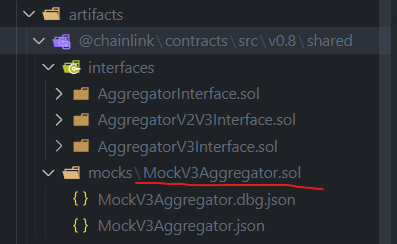
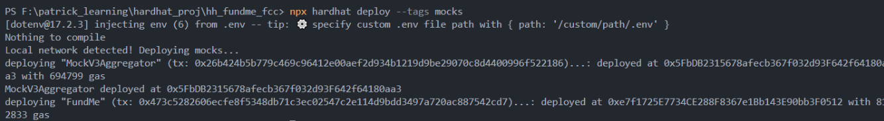

# FundMe Smart Contract with Mock Oracle - Complete Guide

**Author:** Peile Wu  
**Email:** peile.wu.1990@gmail.com  
**Date:** October 26, 2025  
**Version:** 1.0

---

## Executive Summary

This guide walks you through building and deploying a FundMe contract with local Mock oracle support. The project demonstrates professional multi-chain deployment patterns using Hardhat-Deploy, allowing fast local iteration via Mock pricing oracles while maintaining compatibility with real Chainlink oracles on testnets.

**Key Achievement:** Deploy to both local (Mock) and testnet (Real Oracle) networks using the same codebase.

---

## Table of Contents

1. [Why Mock Oracles?](#why-mock-oracles)
2. [Architecture Overview](#architecture-overview)
3. [Mock Oracle Mechanism](#mock-oracle-mechanism)
4. [Project Structure](#project-structure)
5. [Implementation Steps](#implementation-steps)
6. [Deployment Execution](#deployment-execution)
7. [Command Reference](#command-reference)

---

## Why Mock Oracles?

### The Problem with Testnet-Only Development

Deploying directly to Sepolia testnet for every iteration causes critical issues:

| Issue                   | Impact                                    | Example                                             |
| ----------------------- | ----------------------------------------- | --------------------------------------------------- |
| **Slow Network**        | 🐢 30+ seconds per deployment             | Edit contract → wait 30s → see error → repeat       |
| **Network Instability** | 🔴 Frequent timeouts & failures           | Transaction fails due to RPC timeout, not your code |
| **Slow Feedback Loop**  | ⏳ 2-3 minutes per test cycle             | Development becomes glacially slow                  |
| **Limited Test Tokens** | 💰 Sepolia faucet rate-limited            | Run out of test ETH after 10-15 deployments         |
| **Debugging Nightmare** | 🤯 Hard to isolate network vs code issues | Is it your contract bug or network problem?         |

### The Solution: Local Mock Oracles

Mock oracles simulate real Chainlink oracles locally, providing:

- ⚡ **Instant Deployment** - Milliseconds instead of 30 seconds
- 🎯 **100% Stability** - No network timeouts or errors
- 🎨 **Complete Control** - Set any ETH/USD price for testing
- 💚 **Free** - No test tokens needed
- 🐛 **Perfect Debugging** - Immediate feedback on errors

### Development Workflow

```
Phase 1: Local Development
├─ Use Mock Oracle ($2000/ETH fixed)
├─ Iterate rapidly
├─ Test edge cases with custom prices
└─ All changes complete in seconds

Phase 2: Testnet Verification
├─ Deploy to Sepolia (same code)
├─ Verify real Chainlink oracle integration
├─ Run final tests
└─ Costs only a few Sepolia ETH

Phase 3: Mainnet
├─ Deploy using identical script
├─ Live with real oracle data
└─ Fully tested & confident
```

---

## Architecture Overview

### Network-Aware Deployment

Your deployment system automatically adapts to the target network:

```
Deployment Script
       ↓
┌──────────────────────────┐
│ Check: Local or Testnet? │
└──────────────────────────┘
       ↓
       ├─ Local (hardhat) → Use Mock Oracle
       │                    • Deploy MockV3Aggregator
       │                    • Deploy FundMe with Mock address
       │                    • Price fixed at $2000
       │
       └─ Testnet (sepolia) → Use Real Oracle
                              • Skip Mock deployment
                              • Deploy FundMe with Chainlink address
                              • Price from real market data
```

### Contract Interactions

```
FundMe Contract
    ↓
    ├─ Local Network
    │  └─ Calls Mock Oracle → Always returns $2000
    │
    └─ Sepolia Network
       └─ Calls Real Chainlink → Returns live ETH/USD price
```

---

## Mock Oracle Mechanism

### What is MockV3Aggregator?

MockV3Aggregator is a simulated Chainlink price feed that:

1. **Implements the same interface** as real Chainlink oracles
2. **Returns fixed prices** instead of real market data
3. **Uses 8 decimal places** for precision (Chainlink standard)
4. **Allows custom initialization** of any ETH/USD price

### Price Representation with 8 Decimals

All Chainlink oracles use 8 decimal places to avoid floating-point precision issues:

```
Price Value:     200000000000
Decimal Places:  8
Actual Price:    200000000000 ÷ 10^8 = $2000

Formula: DisplayPrice = StoredValue ÷ 10^8
```

**Why 8 decimals?**

- Avoids floating-point math (which causes precision loss)
- Uses only integers (Solidity native support)
- Matches Chainlink's industry standard
- Maintains compatibility with all DeFi protocols

### Customizing Mock Prices

You can test different scenarios by changing `INITIAL_ANSWER` in `helper-hardhat-config.js`:

```javascript
// Default: Test normal scenario
const INITIAL_ANSWER = 200000000000; // ETH = $2000

// Test high prices
const INITIAL_ANSWER = 300000000000; // ETH = $3000

// Test low prices
const INITIAL_ANSWER = 150000000000; // ETH = $1500

// Test boundary: Minimum funding
const INITIAL_ANSWER = 5000000000; // ETH = $50

// Test extreme: Price crash
const INITIAL_ANSWER = 500000000; // ETH = $5
```

### MockV3Aggregator Constructor

The MockV3Aggregator contract requires exactly two constructor parameters as shown in the Chainlink source:


**Constructor Signature:**

```solidity
constructor(uint8 _decimals, int256 _initialAnswer) {
    decimals = _decimals;
    updateAnswer(_initialAnswer);
}
```

**Parameters Used in Deployment:**

- `_decimals`: `8` (Chainlink standard for all price feeds)
- `_initialAnswer`: `200000000000` (represents $2000 with 8 decimal places)

**How Deployment Script Passes Parameters:**

```javascript
args: [DECIMALS, INITIAL_ANSWER]; // [8, 200000000000]
```

This creates a Mock oracle that returns exactly `200000000000 / 10^8 = $2000` per ETH.

---

## Project Structure

### Complete Directory Layout

```
hh_fundme_fcc/
│
├── contracts/
│   ├── FundMe.sol                    # Main funding contract
│   ├── PriceConverter.sol            # Price conversion library
│   └── test/
│       └── MockV3Aggregator.sol      # Mock oracle (test only)
│
├── deploy/
│   ├── 00-deploy-mocks.js           # Deploy Mock oracle (runs first)
│   └── 01-deploy-fund-me.js         # Deploy FundMe (runs second)
│
├── deployments/                      # Auto-generated deployment records
│   └── hardhat/
│       ├── MockV3Aggregator.json
│       └── FundMe.json
│
├── artifacts/                        # Compiled contracts
│   └── @chainlink/contracts/
│       └── src/v0.8/
│           └── mocks/
│               └── MockV3Aggregator.sol
│                   ├── MockV3Aggregator.dbg.json
│                   └── MockV3Aggregator.json
│
├── img/                             # Screenshots & diagrams
│   └── mock_helper_hardhat_config/
│       ├── compiled_MockV3Aggregator.png
│       ├── deploy_MockV3Aggregator.png
│       ├── MockV3Aggregator_constructor_para...png
│       ├── tag_mocks_deployed.png
│       └── npx_hardhat_deploy_result.png
│
├── helper-hardhat-config.js         # Network config center
├── hardhat.config.js                # Hardhat configuration
├── package.json                     # Dependencies
├── .env                            # Environment variables
├── .gitignore
└── hardhat_fundMe.md               # Detailed documentation
```

### Key Directories Explained

**`contracts/test/`**

- Contains MockV3Aggregator.sol
- Separated from production contracts
- Only compiled when needed
- Never deployed to mainnet

**`artifacts/@chainlink/contracts/`**

- Generated after compilation
- Contains MockV3Aggregator's ABI & bytecode
- Used by deploy scripts for actual deployment

**`deployments/`**

- Auto-created by hardhat-deploy
- Stores deployment records with:
  - Contract address
  - Constructor parameters
  - Transaction hash
  - ABI & bytecode
- Enables repeatable deployments

---

## Implementation Steps

### Step 1: Configure Helper Config

**File:** `helper-hardhat-config.js`

```javascript
const networkConfig = {
  // Sepolia testnet
  11155111: {
    name: "sepolia",
    ethUsdPriceFeed: "0x694AA1769357215DE4FAC081bf1f309aDC325306",
  },
  // Arbitrum Sepolia
  421614: {
    name: "arbitrumSepolia",
    ethUsdPriceFeed: "0xd30e2101a97dcbAeBCBC04F14C3f624E67A35165",
  },
  // OP Sepolia
  11155420: {
    name: "opSepolia",
    ethUsdPriceFeed: "0x61Ec26aA57019C486B10502285c5A3D4A4750AD7",
  },
};

// Development chains require Mock deployment
const developmentChains = ["hardhat", "localhost"];

// Mock oracle parameters
const DECIMALS = 8; // Standard Chainlink decimals
const INITIAL_ANSWER = 200000000000; // ETH price: $2000

module.exports = {
  networkConfig,
  developmentChains,
  DECIMALS,
  INITIAL_ANSWER,
};
```

**What this configures:**

- Network-to-oracle-address mapping for testnets
- Which networks should use Mock vs real oracles
- The mock price: $2000 per ETH

---

### Step 2: Create Mock Deployment Script

**File:** `deploy/00-deploy-mocks.js`

```javascript
const { network } = require("hardhat");
const {
  developmentChains,
  DECIMALS,
  INITIAL_ANSWER,
} = require("../helper-hardhat-config");

module.exports = async ({ getNamedAccounts, deployments }) => {
  const { deploy, log } = deployments;
  const { deployer } = await getNamedAccounts();

  // Only deploy Mock on local development networks
  if (developmentChains.includes(network.name)) {
    log("Local network detected! Deploying mocks ...");

    // Deploy MockV3Aggregator with custom price
    await deploy("MockV3Aggregator", {
      contract: "MockV3Aggregator", // Contract name in artifacts
      from: deployer, // Who deploys
      log: true, // Print deployment info
      args: [DECIMALS, INITIAL_ANSWER], // Constructor params: decimals=8, price=$2000
    });

    log("Mocks deployed!");
    log("----------------------------------------------");
  }
};

module.exports.tags = ["all", "mocks"];
```

**Key Points:**

- `if (developmentChains.includes(network.name))` ensures Mock only deploys locally
- `args: [DECIMALS, INITIAL_ANSWER]` passes constructor parameters
- `tags: ["all", "mocks"]` allows selective deployment via `--tags` flag

---

### Step 3: Update FundMe Contract

**File:** `contracts/FundMe.sol` (Key sections)

```solidity
// Import Chainlink interface
import "./PriceConverter.sol";

contract FundMe {
    using PriceConverter for uint256;

    // Store the oracle address (parameterized)
    AggregatorV3Interface public priceFeed;

    // Accept price feed address in constructor
    constructor(address priceFeedAddress) {
        i_owner = msg.sender;
        // This works for both Mock and real oracles
        priceFeed = AggregatorV3Interface(priceFeedAddress);
    }

    // Use the oracle in fund function
    function fund() public payable {
        require(
            msg.value.getConversionRate(priceFeed) >= MINIMUM_USD,
            "Didn't send enough USD ..."
        );
        funders.push(msg.sender);
        addressToAmountFunded[msg.sender] = msg.value;
    }
}
```

**Benefits:**

- Constructor parameter allows different oracle addresses
- Same contract works for Mock or real Chainlink
- No hardcoded addresses needed

---

### Step 4: Update FundMe Deployment

**File:** `deploy/01-deploy-fund-me.js`

```javascript
const { network } = require("hardhat");
const {
  networkConfig,
  developmentChains,
} = require("../helper-hardhat-config");

module.exports = async ({ getNamedAccounts, deployments }) => {
  const { deploy, log } = deployments;
  const { deployer } = await getNamedAccounts();
  const chainId = network.config.chainId;

  let ethUsdPriceFeedAddress;

  // Smart network detection
  if (developmentChains.includes(network.name)) {
    // Local network: Get Mock address
    const mockAggregator = await deployments.get("MockV3Aggregator");
    ethUsdPriceFeedAddress = mockAggregator.address;
    log(`Using Mock oracle: ${ethUsdPriceFeedAddress}`);
  } else {
    // Testnet: Get real Chainlink address from config
    ethUsdPriceFeedAddress = networkConfig[chainId]["ethUsdPriceFeed"];
    log(`Using real Chainlink oracle: ${ethUsdPriceFeedAddress}`);
  }

  // Deploy FundMe with appropriate oracle address
  const fundMe = await deploy("FundMe", {
    from: deployer,
    args: [ethUsdPriceFeedAddress], // Critical: Pass oracle address
    log: true,
  });

  log("---------------------------------------------");
};

module.exports.tags = ["all", "fundme"];
```

**Logic Flow:**

1. Check if network is in `developmentChains` array
2. If local → get just-deployed Mock address via `deployments.get()`
3. If testnet → look up real Chainlink address from config
4. Deploy FundMe with correct address as constructor parameter

---

### Step 5: Configure hardhat.config.js

**File:** `hardhat.config.js` (Key sections)

```javascript
require("dotenv").config();
require("hardhat-deploy");

const SEPOLIA_RPC_URL = process.env.SEPOLIA_RPC_URL || "";
const PRIVATE_KEY = process.env.PRIVATE_KEY || "";

module.exports = {
  defaultNetwork: "hardhat", // Local network by default

  namedAccounts: {
    deployer: {
      default: 0, // First account is deployer
    },
  },

  networks: {
    hardhat: {
      chainId: 31337, // Local network ID
    },
    sepolia: {
      url: SEPOLIA_RPC_URL,
      accounts: [PRIVATE_KEY],
      chainId: 11155111,
    },
    localhost: {
      url: "http://127.0.0.1:8545/",
      chainId: 31337,
    },
  },

  solidity: {
    compilers: [{ version: "0.6.18" }, { version: "0.8.18" }],
  },
};
```

---

## Deployment Execution

### Workflow Overview

```
Development Cycle:
1. Modify contracts → Compile
2. Deploy locally with Mock → Test
3. Modify tests → Deploy → Repeat
4. Deploy to Sepolia → Final verification
5. Deploy to Mainnet (when ready)
```

### Command 1: Compile All Contracts

```bash
npx hardhat compile
```

**Output Example:**

```
Compiling 1 file with 0.8.18
Successfully compiled 3 files with 0.8.18
```

**Compiled MockV3Aggregator:**



The image shows the successful compilation results in the artifacts folder:

- `MockV3Aggregator.json` contains the full ABI and bytecode
- `MockV3Aggregator.dbg.json` contains debug information
- Both files are needed for deployment

**What's Verified:**

- ✅ All contract syntax is correct
- ✅ Chainlink imports resolve successfully
- ✅ ABI and bytecode generated in artifacts/
- ✅ No compilation errors

**Generated Artifacts:**

```
artifacts/
└── @chainlink/contracts/src/v0.8/mocks/
    └── MockV3Aggregator.sol/
        ├── MockV3Aggregator.json       # Full ABI + bytecode
        └── MockV3Aggregator.dbg.json   # Debug info
```

---

### Command 2: Deploy Only Mock (Tag Filter)

```bash
npx hardhat deploy --tags mocks
```

**Deployment Output:**



**Console Output Breakdown:**

```
Local network detected! Deploying mocks ...
deploying "MockV3Aggregator" (tx: 0x26b424b5b779c469c96412e00aef2d934b1219d9be29070c8d440996f522186):
  ... deployed at 0x5FbDB2315678afecb367f032d93f642f6418c with 694799 gas
Mocks deployed!
----------------------------------------------
```

**What's Verified:**

- ✅ Tag system works: only "mocks" scripts execute
- ✅ Mock successfully deploys to local Hardhat network
- ✅ Contract address: `0x5FbD...` (now available for use)
- ✅ Mock now returns: **ETH/USD = $2000 (fixed)**
- ✅ Gas consumed: 694799 (local testing, no real cost)

**Deployment Record Created:**

```
deployments/hardhat/MockV3Aggregator.json
{
  "address": "0x5FbDB2315678afecb367f032d93f642f6418c",
  "abi": [...],
  "args": [8, 200000000000],
  "receipt": {...},
  "transactionHash": "0x26b424b5b779c469c96412e00aef2d934b1219d9be29070c8d440996f522186"
}
```

---

### Command 3: Complete Deployment (All Tags)

```bash
npx hardhat deploy
```

**Output Example:**

```
Local network detected! Deploying mocks ...
deploying "MockV3Aggregator" (tx: 0x26b424b5b779c469c96412e00aef2d934b1219d9be29070c8d440996f522186):
  ... deployed at 0x5FbDB2315678afecb367f032d93f642f6418c with 694799 gas
Mocks deployed!
----------------------------------------------

deploying "FundMe" (tx: 0x473c5282606ecfe8f5348db71c3ec02547c2e114d9bdd3497a720ac887542cd7):
  ... deployed at 0xe7f1725E7734cE288F8367e1Bb143E90bb3F0512 with 2833 gas
---------------------------------------------
```

**Complete Verification:**

- ✅ Step 1: MockV3Aggregator deployed at `0x5FbD...`

  - Set to return: **$2000 per ETH** (fixed, for testing)
  - Ready to provide prices to FundMe

- ✅ Step 2: FundMe deployed at `0xe7f1...`

  - Receives Mock address as constructor param
  - Now configured to use Mock for price queries
  - `fund()` function will call Mock oracle

- ✅ Execution Order: Correct (00→01)
  - Mock deployed first, address available
  - FundMe deployed second, uses Mock address

**Deployment Timeline:**

```
Time 0ms:   00-deploy-mocks.js starts
Time 50ms:  MockV3Aggregator deployed at 0x5FbD...
Time 100ms: 01-deploy-fund-me.js starts
Time 150ms: Gets Mock address via deployments.get()
Time 200ms: FundMe deployed at 0xe7f1...
Time 250ms: Both contracts ready to use
```

**Created Records:**

```
deployments/hardhat/
├── MockV3Aggregator.json
└── FundMe.json
```

---

### Command 4: Deploy to Sepolia Testnet

```bash
npx hardhat deploy --network sepolia
```

**Execution Flow:**

```
00-deploy-mocks.js:
  network.name = "sepolia"
  developmentChains.includes("sepolia") = false
  → SKIPPED (no Mock deployment)

01-deploy-fund-me.js:
  network.name = "sepolia"
  developmentChains.includes("sepolia") = false
  → Enter else block
  → chainId = 11155111
  → networkConfig[11155111]["ethUsdPriceFeed"]
  → Returns real Chainlink address: 0x694AA1769357215DE4FAC081bf1f309aDC325306
  → Deploy FundMe with real oracle address
```

**Key Difference from Local:**

- Mock oracle NOT deployed (saves gas)
- FundMe uses real Chainlink oracle
- Prices are live market data (not fixed $2000)

---

## Local vs Testnet Comparison

### Price Data

```
Local (Hardhat)        vs    Sepolia Testnet
─────────────────           ─────────────────
Mock Price: $2000      vs    Real Price: Live
Fixed (static)         vs    Dynamic (updates)
Controlled by test     vs    From Chainlink node
Instant response       vs    Network dependent
```

### Deployment Speed

```
Local              vs    Testnet
──────                  ────────
⚡ Milliseconds   vs    🐢 30+ seconds
Instant feedback  vs    Long wait
Retry in seconds  vs    Retry in minutes
```

### Network Stability

```
Local                vs    Testnet
─────                    ────────
🟢 100% Stable    vs    🟡 Occasional issues
Never fails       vs    Timeouts possible
Predictable       vs    Unpredictable
```

### Cost

```
Local              vs    Testnet
──────                  ────────
💚 Free          vs    💰 Sepolia ETH
No gas           vs    Real gas spent
Unlimited        vs    Limited faucet
```

---

## Advanced Usage

### Testing Different Price Scenarios

Edit `INITIAL_ANSWER` to test various market conditions:

```javascript
// Test normal market
const INITIAL_ANSWER = 200000000000; // ETH = $2000

// Test bull market
const INITIAL_ANSWER = 500000000000; // ETH = $5000

// Test bear market
const INITIAL_ANSWER = 50000000000; // ETH = $500

// Test minimum funding threshold
const INITIAL_ANSWER = 5000000000; // ETH = $50

// Test extreme crash
const INITIAL_ANSWER = 100000000; // ETH = $1
```

After changing `INITIAL_ANSWER`:

1. Run `npx hardhat deploy` again
2. Mock redeploys with new price
3. All subsequent tests use new price

### Switching Between Networks

```bash
# Deploy to local (default)
npx hardhat deploy

# Deploy to Sepolia
npx hardhat deploy --network sepolia

# Deploy to Arbitrum (if configured)
npx hardhat deploy --network arbitrumSepolia

# Testnet with specific tags
npx hardhat deploy --network sepolia --tags fundme
```

---

## Command Reference

| Command                                | Purpose                    | Output                     |
| -------------------------------------- | -------------------------- | -------------------------- |
| `npx hardhat compile`                  | Compile all contracts      | Generates artifacts/       |
| `npx hardhat deploy`                   | Deploy all scripts locally | Deploys Mock + FundMe      |
| `npx hardhat deploy --tags mocks`      | Deploy only Mock           | Deploys only Mock          |
| `npx hardhat deploy --tags fundme`     | Deploy only FundMe         | Deploys only FundMe        |
| `npx hardhat deploy --network sepolia` | Deploy to Sepolia          | Uses real Chainlink        |
| `npx hardhat node`                     | Start local node           | Runs local Hardhat network |
| `npx hardhat test`                     | Run tests                  | Executes test suite        |

---

## Deployment Success Checklist

After running `npx hardhat deploy`, verify:

### ✅ Console Output

```
[✓] "Local network detected! Deploying mocks ..."
[✓] "MockV3Aggregator" shows deployed at 0x...
[✓] "Mocks deployed!"
[✓] "FundMe" shows deployed at 0x...
```

### ✅ Deployment Records

```bash
ls deployments/hardhat/
# Should show:
# - MockV3Aggregator.json
# - FundMe.json
```

### ✅ Record Contents

Each JSON file contains:

```json
{
  "address": "0x...",
  "abi": [...],
  "args": [...],
  "transactionHash": "0x...",
  "receipt": {...}
}
```

### ✅ Logic Verification

- Mock deploys first, FundMe second ✓
- FundMe receives Mock address as parameter ✓
- Mock configured to return $2000 ✓
- Local network uses Mock, Sepolia uses real oracle ✓

---

## Development Workflow Summary

```
1. Write/modify contracts
2. Run: npx hardhat compile
   └─ Verify no syntax errors
3. Run: npx hardhat deploy
   └─ Deploy Mock locally
   └─ Deploy FundMe with Mock
4. Run: npx hardhat test
   └─ Test with $2000/ETH price
5. If needed: Change INITIAL_ANSWER
   └─ Rerun deployment
   └─ Test different price scenarios
6. Run: npx hardhat deploy --network sepolia
   └─ Deploy to Sepolia with real Chainlink
   └─ Verify testnet deployment
7. (Mainnet when ready)
   └─ Same script, different network
```

---

## Key Takeaways

1. **Mock oracles enable rapid local development** - Deploy in milliseconds, test instantly
2. **Same code works everywhere** - Deploy script handles Mock vs real oracle automatically
3. **Complete control over test conditions** - Set any ETH/USD price for comprehensive testing
4. **Zero cost local testing** - No test tokens needed for local iteration
5. **Professional pattern** - Industry standard used by major DeFi projects
6. **Smooth transition to mainnet** - Tested locally, verified on testnet, confident on mainnet

---

## Next Steps

1. ✅ Complete local testing with Mock
2. ✅ Iterate on contract logic
3. ✅ Test edge cases with custom prices
4. ✅ Deploy to Sepolia for final verification
5. ✅ Verify integration with real Chainlink
6. ✅ Deploy to mainnet (when production-ready)

---

## Resources

- [Hardhat Documentation](https://hardhat.org/docs)
- [Hardhat-Deploy GitHub](https://github.com/wighawag/hardhat-deploy)
- [Chainlink Data Feeds](https://docs.chain.link/data-feeds)
- [Ethers.js V5 Documentation](https://docs.ethers.org/v5/)

---

**Note:** This is an educational project. Always test thoroughly on testnet before mainnet deployment. Never use real private keys in version control.
