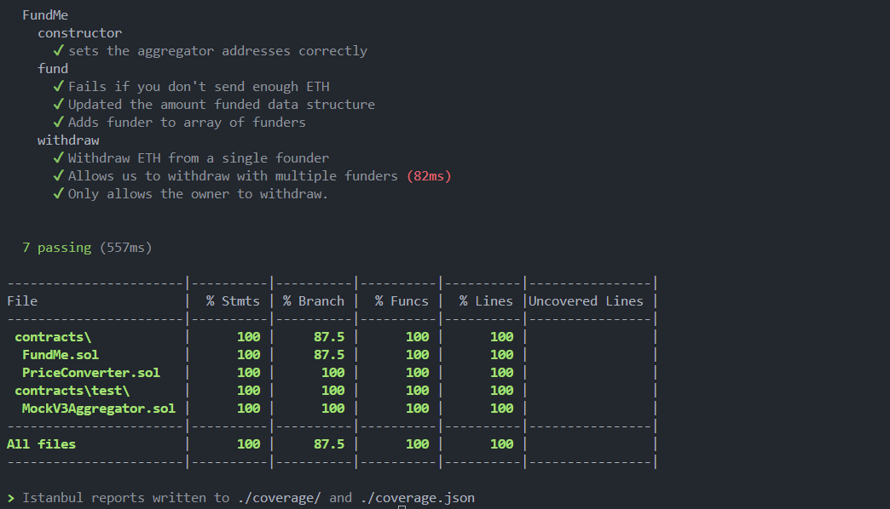

# FundMe Contract Testing Guide

**Author:** Peile Wu  
**Email:** peile.wu.1990@gmail.com  
**Date:** October 28, 2025

---

## Table of Contents

1. [Overview](#overview)
2. [Project Structure](#project-structure)
3. [Setup and Installation](#setup-and-installation)
4. [Testing Framework](#testing-framework)
5. [Test Execution Flow](#test-execution-flow)
6. [Test Cases](#test-cases)
7. [Withdraw Test - Detailed Breakdown](#withdraw-test---detailed-breakdown)
8. [Multiple Funders Withdraw Test](#multiple-funders-withdraw-test)
9. [Owner Permission Test](#owner-permission-test)
10. [Debugging Techniques](#debugging-techniques)
11. [Running Tests](#running-tests)
12. [Code Coverage](#code-coverage)
13. [Key API Changes (ethers v5 to v6)](#key-api-changes-ethers-v5-to-v6)
14. [Summary](#summary)

---

## Overview

Testing smart contracts is essential for optimization, gas efficiency, and security. This guide demonstrates comprehensive testing of the FundMe contract using two types of tests:

- **Unit Tests (UT):** Test individual code units locally on Hardhat
- **Staging Tests (ST):** Test on testnets before mainnet deployment

This document focuses on Unit Tests using Hardhat with hardhat-deploy.

---

## Project Structure

Create the following directory structure in your project root:

```
hh_fundme_fcc/
├── contracts/
│   ├── FundMe.sol
│   ├── PriceConverter.sol
│   └── test/
│       └── MockV3Aggregator.sol
├── deploy/
│   ├── 00-deploy-mocks.js
│   └── 01-deploy-fundme.js
├── test/
│   ├── unit/
│   │   └── FundMe_test.js          ← Unit tests (local Hardhat)
│   └── staging/
│       └── FundMe_staging.js       ← Staging tests (testnet only)
├── hardhat.config.js
├── .env
└── package.json
```

**Key Point:** Always run `npx hardhat test` from the **project root** directory, not from subdirectories.

---

## Setup and Installation

### 1. Initialize Project

```bash
npm init -y
npm install --save-dev hardhat
npx hardhat
```

### 2. Install Required Dependencies

```bash
npm install --save-dev \
  @nomiclabs/hardhat-etherscan \
  @nomicfoundation/hardhat-chai-matchers \
  @nomicfoundation/hardhat-ethers \
  dotenv \
  ethers \
  hardhat-deploy \
  hardhat-deploy-ethers \
  hardhat-gas-reporter \
  solidity-coverage \
  chai
```

### 3. Handle Version Conflicts

Since we're using **ethers v6** and **hardhat-deploy-ethers v0.3.0-beta.13** (which supports ethers v5), install with legacy peer dependencies:

```bash
npm install --legacy-peer-deps
```

---

## Testing Framework

### Required Libraries

#### 1. **@nomicfoundation/hardhat-chai-matchers**

This replaces the deprecated Waffle library for advanced assertions.

**Installation:**

```bash
npm install --save-dev @nomicfoundation/hardhat-chai-matchers
```

**Configuration in hardhat.config.js:**

```javascript
require("@nomicfoundation/hardhat-chai-matchers");
```

**Import in test file:**

```javascript
const { assert, expect } = require("chai");
require("@nomicfoundation/hardhat-chai-matchers");
```

#### 2. **hardhat-deploy**

Manages smart contract deployments with fixtures for testing.

**Key functions:**

- `deployments.fixture(["all"])` - Deploy all contracts with "all" tag
- `deployments.get("ContractName")` - Get contract deployment info
- `ethers.getContractAt()` - Connect to deployed contracts

#### 3. **ethers v6**

JavaScript SDK for Ethereum interaction. API differs significantly from v5.

---

## Test Execution Flow

Understanding when different phases occur is crucial. Here's the complete flow:

### Phase 1: Contract Deployment – in `beforeEach`

```javascript
beforeEach(async function () {
  // Step 1: Deploy all contracts
  await deployments.fixture(["all"]); // ← Constructor runs here

  // Step 2: Get deployer account
  deployer = (await getNamedAccounts()).deployer;

  // Step 3: Get FundMe contract and connect to it
  const FundMeDeployment = await deployments.get("FundMe");
  fundMe = await ethers.getContractAt(
    "FundMe",
    FundMeDeployment.address,
    await ethers.getSigner(deployer)
  );
  // ← Now fundMe is a contract instance we can call functions on

  // Step 4: Get MockV3Aggregator contract
  const MockV3Deployment = await deployments.get("MockV3Aggregator");
  mockV3Aggregator = await ethers.getContractAt(
    "MockV3Aggregator",
    MockV3Deployment.address,
    await ethers.getSigner(deployer)
  );
});
```

**What happens in this phase:**

- `deployments.fixture(["all"])` deploys all contracts from `/deploy` folder
- Contract constructors execute during deployment
- We retrieve deployed contract addresses
- We create contract instances to interact with

**Timeline:** This runs **before each test**, so every test gets fresh contracts

### Phase 2: Contract Interaction (Function Calls) – in `it()` blocks

**Example 1: Testing the fund() function**

```javascript
it("Updated the amount funded data structure", async function () {
  // INTERACT: Call the fund() function on the contract
  await fundMe.fund({ value: sendValue });

  // INTERACT: Read the mapping to verify data was stored
  const response = await fundMe.addressToAmountFunded(deployer);

  // VERIFY: Assert the result matches what we sent
  assert.equal(response.toString(), sendValue.toString());
});
```

**What happens:**

1. `fundMe.fund({ value: sendValue })` - Calls contract's fund function and sends 1 ETH
2. `fundMe.addressToAmountFunded(deployer)` - Reads the mapping to verify ETH amount was recorded
3. `assert.equal()` - Verifies the recorded amount equals what was sent

**Example 2: Testing the withdraw() function**

```javascript
it("Withdraw ETH from a single founder", async function () {
  // INTERACT: Call the withdraw() function
  const transactionResponse = await fundMe.withdraw();
  const transactionReceipt = await transactionResponse.wait(1);

  // VERIFY: Check if contract balance is now 0
  const endingFundMeBalance = await ethers.provider.getBalance(fundMe.target);
  assert.equal(endingFundMeBalance, 0);
});
```

**What happens:**

1. `fundMe.withdraw()` - Calls the contract's withdraw function
2. `.wait(1)` - Waits for 1 block confirmation
3. `ethers.provider.getBalance()` - Reads the contract's ETH balance
4. `assert.equal()` - Verifies the balance is now 0

### Complete Test Execution Timeline

```
beforeEach()
  ↓
  [Deploy contracts with deployments.fixture()]
  [Constructor runs automatically]
  [Connect to contract instances]
  ↓
it("test case 1")
  ↓
  [Call contract functions: fundMe.fund()]
  [Read contract state: fundMe.addressToAmountFunded()]
  [Verify with assertions]
  ↓
beforeEach()  ← Runs again! Fresh contracts deployed
  ↓
  [Deploy contracts again]
  ↓
it("test case 2")
  ↓
  [Call different contract functions: fundMe.withdraw()]
  [Verify results]
```

**Key Points:**

- **Deployment** happens in `beforeEach()` - `deployments.fixture()` and `ethers.getContractAt()`
- **Function Calls** happen in `it()` blocks - `fundMe.fund()`, `fundMe.withdraw()`, etc.
- **Constructor** executes automatically during `deployments.fixture()` in beforeEach
- Each test gets **fresh contracts** because `beforeEach()` runs before every test

---

## Test Cases

### Test 1: Constructor Tests

Verifies that the constructor correctly sets the price feed address.

```javascript
describe("constructor", async function () {
  it("sets the aggregator addresses correctly", async function () {
    // CONTRACT INTERACTION: Read from storage variable set by constructor
    const response = await fundMe.priceFeed();

    // VERIFICATION: Check if it matches the mock aggregator address
    assert.equal(response, mockV3Aggregator.target);
  });
});
```

---

### Test 2: Fund Function Tests

Tests the fund() function with various scenarios.

**Test 2a: Revert with insufficient ETH**

```javascript
it("Fails if you don't send enough ETH", async function () {
  // CONTRACT INTERACTION: Call fund() without sending value
  // This should trigger the require statement in the contract
  await expect(fundMe.fund()).to.be.revertedWith("Didn't send enough USD ...");
});
```

**Test 2b: Update funding data structure**

```javascript
const sendValue = ethers.parseEther("1");

it("Updated the amount funded data structure", async function () {
  // CONTRACT INTERACTION: Send 1 ETH to fund() function
  await fundMe.fund({ value: sendValue });

  // CONTRACT INTERACTION: Read the mapping to verify amount was recorded
  const response = await fundMe.addressToAmountFunded(deployer);

  // VERIFICATION: Check if recorded amount equals sent amount
  assert.equal(response.toString(), sendValue.toString());
});
```

**Test 2c: Add funder to array**

```javascript
it("Adds funder to array of funders", async function () {
  // CONTRACT INTERACTION: Send ETH to trigger fund() function
  await fundMe.fund({ value: sendValue });

  // CONTRACT INTERACTION: Read the funders array at index 0
  const funder = await fundMe.funders(0);

  // VERIFICATION: Verify that deployer address was added to the array
  assert.equal(funder, deployer);
});
```

---

## Withdraw Test - Detailed Breakdown

The withdraw test is more complex because it validates state changes before and after a transaction. Let's examine each step:

### Full Withdraw Test Code

```javascript
describe("withdraw", async function () {
  // Setup: Fund the contract before each withdraw test
  beforeEach(async function () {
    await fundMe.fund({ value: sendValue });
  });

  it("Withdraw ETH from a single founder", async function () {
    // ========== ARRANGE PHASE ==========
    // Get initial balances BEFORE withdrawal

    const startingFundMeBalance = await ethers.provider.getBalance(
      fundMe.target
    );
    // ← Reads how much ETH the contract currently holds
    // ← Expected: 1 ETH (from beforeEach setup)

    const startingDeployerBalance = await ethers.provider.getBalance(deployer);
    // ← Reads how much ETH the deployer account has BEFORE withdrawal
    // ← This includes gas costs the deployer has already spent

    // ========== ACT PHASE ==========
    // Execute the withdraw function

    const transactionResponse = await fundMe.withdraw();
    // ← Calls the withdraw() function on the contract
    // ← This transaction will:
    //   1. Transfer all ETH from contract to deployer
    //   2. Clear the funders array
    //   3. Reset all mapping values
    // ← Returns a transaction response object

    const transactionReceipt = await transactionResponse.wait(1);
    // ← Waits for 1 block confirmation
    // ← Returns receipt with transaction details (gas used, etc)

    // Calculate gas cost of this transaction
    const gasCost = transactionReceipt.gasUsed * transactionReceipt.gasPrice;
    // ← Gas cost = amount of gas used × gas price per unit
    // ← Example: 50,000 gas × 20 gwei = cost in wei
    // ← This is what the deployer paid for the transaction

    // ========== ASSERT PHASE ==========
    // Get final balances AFTER withdrawal

    const endingFundMeBalance = await ethers.provider.getBalance(fundMe.target);
    // ← Reads how much ETH the contract holds NOW
    // ← Expected: 0 (all ETH was withdrawn)

    const endingDeployerBalance = await ethers.provider.getBalance(deployer);
    // ← Reads how much ETH the deployer has NOW
    // ← This is starting balance + 1 ETH received - gas cost paid

    // ========== VERIFICATION 1 ==========
    // Contract should be empty after withdrawal
    assert.equal(endingFundMeBalance, 0n);
    // ← Verifies that contract balance is exactly 0
    // ← If this fails, ETH is still locked in the contract

    // ========== VERIFICATION 2 ==========
    // Deployer should have received all funds minus gas cost
    assert.equal(
      (startingFundMeBalance + startingDeployerBalance).toString(),
      (endingDeployerBalance + gasCost).toString()
    );
    // ← Breaking this down:
    //   Left side:  Starting contract balance + Starting deployer balance
    //   Right side: Ending deployer balance + Gas cost paid
    //
    // ← In math terms:
    //   (ContractStart + DeployerStart) = DeployerEnd + GasCost
    //
    // ← Rearranged:
    //   ContractStart = DeployerEnd - DeployerStart + GasCost
    //   1 ETH = Received ETH + Gas spent
    //
    // ← This proves the deployer received the contract's ETH
    //   minus only the gas fees paid for the transaction
  });
});
```

### Visual Breakdown of Balance Changes

```
BEFORE WITHDRAW:
┌──────────────────────┐
│ Contract:  1 ETH     │  ← From beforeEach: await fundMe.fund({ value: sendValue })
│ Deployer: X ETH      │
└──────────────────────┘

WITHDRAW TRANSACTION:
  fundMe.withdraw()
    ↓
    [Transfer 1 ETH from contract to deployer]
    [Pay gas fee from deployer's balance]
    ↓

AFTER WITHDRAW:
┌──────────────────────────────────────┐
│ Contract:  0 ETH                     │  ← All withdrawn
│ Deployer: X + 1 - gasCost ETH        │  ← Gained 1 ETH, minus gas
└──────────────────────────────────────┘

TEST VERIFIES:
✓ Contract balance is 0
✓ Deployer gained exactly 1 ETH minus gas cost
✓ No ETH was lost or gained unexpectedly
```

---

## Multiple Funders Withdraw Test

This test verifies that the withdraw function works correctly when multiple users have contributed to the contract. It also validates that data structures are properly reset after withdrawal.

```javascript
it("Allows us to withdraw with multiple funders", async function () {
  // ========== ARRANGE PHASE ==========
  // Get all available accounts from ethers
  const accounts = await ethers.getSigners();

  // Multiple accounts fund the contract (accounts 1-5)
  for (let i = 1; i < 6; i++) {
    // Connect the contract to account[i] to simulate that account calling fund()
    const fundMeConnectedContract = await fundMe.connect(accounts[i]);

    // Each account sends 1 ETH
    await fundMeConnectedContract.fund({ value: sendValue });
  }

  // Capture balances before withdrawal
  const startingFundMeBalance = await ethers.provider.getBalance(fundMe.target);
  // ← Contract now holds 5 ETH total (1 ETH × 5 funders)

  const startingDeployerBalance = await ethers.provider.getBalance(deployer);

  // ========== ACT PHASE ==========
  // Deployer (contract owner) withdraws all funds
  const transactionResponse = await fundMe.withdraw();
  const transactionReceipt = await transactionResponse.wait(1);

  // Calculate gas cost
  const gasCost = transactionReceipt.gasUsed * transactionReceipt.gasPrice;

  // Capture balances after withdrawal
  const endingFundMeBalance = await ethers.provider.getBalance(fundMe.target);
  const endingDeployerBalance = await ethers.provider.getBalance(deployer);

  // ========== ASSERT PHASE ==========
  // Verify contract is empty
  assert.equal(endingFundMeBalance, 0n);

  // Verify deployer received all funds (minus gas cost)
  assert.equal(
    (startingFundMeBalance + startingDeployerBalance).toString(),
    (endingDeployerBalance + gasCost).toString()
  );

  // Make sure that the funders array is reset properly
  // Attempting to access a non-existent funder should revert
  await expect(fundMe.funders(0)).to.be.reverted;

  // Verify that all funder mappings are reset to 0
  for (let i = 1; i < 6; i++) {
    assert.equal(await fundMe.addressToAmountFunded(accounts[i].address), 0);
  }
});
```

**Key Validations:**

- ✓ Contract balance becomes 0 after withdrawal
- ✓ Deployer receives all 5 ETH (minus gas costs)
- ✓ Funders array is properly cleared (accessing index 0 reverts)
- ✓ All funder contributions in the mapping are reset to 0
- ✓ No ETH is lost in the process

---

## Owner Permission Test

This test ensures that only the contract owner can call the withdraw function. It verifies the `onlyOwner` modifier is working correctly by simulating an attack from an unauthorized account.

```javascript
it("Only allows the owner to withdraw", async function () {
  // ========== ARRANGE PHASE ==========
  // Get all available accounts
  const accounts = await ethers.getSigners();

  // Designate the second account as an attacker
  // (account[0] is the deployer/owner, account[1] is the attacker)
  const attacker = accounts[1];

  // ========== ACT & ASSERT PHASE ==========
  // Connect the contract to the attacker's account
  const attackerConnectedContract = await fundMe.connect(attacker);

  // Verify that the attacker's withdrawal attempt is reverted
  // The onlyOwner modifier should prevent this unauthorized access
  await expect(attackerConnectedContract.withdraw()).to.be.reverted;
});
```

**Security Verification:**

- ✓ Non-owner accounts cannot call withdraw()
- ✓ The `onlyOwner` modifier is properly enforced
- ✓ Unauthorized withdrawal attempts are rejected with revert
- ✓ Contract funds are protected from unauthorized access

---

## Debugging Techniques

### Console Logging in Solidity Contracts

You can use Hardhat's built-in console logging feature to debug your Solidity contracts, similar to logging in JavaScript.

#### Step 1: Import Hardhat Console

Add this import to your Solidity contract:

```solidity
import "hardhat/console.sol";
```

#### Step 2: Use Console Functions

Inside your contract functions, you can now use console logging:

```solidity
function fund() public payable {
    console.log("Fund called with value:", msg.value);
    console.log("Sender address:", msg.sender);

    require(PriceConverter.getConversionRate(msg.value, s_priceFeed) >= MINIMUM_USD,
            "Didn't send enough USD");

    s_addressToAmountFunded[msg.sender] += msg.value;
    s_funders.push(msg.sender);

    console.log("Amount funded for sender:", s_addressToAmountFunded[msg.sender]);
}
```

#### Step 3: Run Tests Normally

When you run `npx hardhat test`, the console output will be displayed in the test runner output. This helps you observe contract behavior in real-time:

```
  FundMe
    constructor
      ✓ sets the aggregator addresses correctly
Fund called with value: 1000000000000000000
Sender address: 0x70997970C51812e339D9B73b0245e3064712ccf1
Amount funded for sender: 1000000000000000000
      ✓ Updated the amount funded data structure
```

**Benefits:**

- Monitor variable values during contract execution
- Trace function flow and decision paths
- Identify unexpected state changes
- Debug gas-related issues

---

## Running Tests

### Execute All Tests

```bash
npx hardhat test
```

### Run Specific Test Suite

```bash
npx hardhat test --grep "constructor"
npx hardhat test --grep "fund"
npx hardhat test --grep "withdraw"
```

### Run with Coverage Report

```bash
npx hardhat coverage
```

---

## Debugging with Breakpoints

VSCode allows you to debug tests by setting breakpoints and inspecting variables during execution.

### Step 1: Set Breakpoints in VSCode

Click on the line number in VSCode to set a breakpoint. A red dot will appear.

### Step 2: Run Tests with Debugger

In the terminal, switch to your project directory and run:

```bash
npx hardhat test
```

The execution will pause at your breakpoint, allowing you to inspect the call stack and variable values.

### Step 3: Inspect Variables in Debug Console

In the debug console, type the variable name to inspect its contents. For example, type `transactionReceipt` to see transaction details.

### Step 4: Find Gas Information

Look for gas-related fields in the transactionReceipt object. You'll see `gasUsed` and `gasPrice` (both are BigNumber types).

### Calculating Gas Cost

Gas cost is calculated by multiplying gas used by gas price per unit:

```javascript
const gasCost = transactionReceipt.gasUsed * transactionReceipt.gasPrice;
// Example: 50,000 gas × 20 gwei = total gas cost in wei
```

This value represents the actual ETH paid for the transaction execution.

---

## Code Coverage

### Coverage Metrics Explained

Running `npx hardhat coverage` generates a detailed report showing which parts of your code were executed during testing.

### Final Coverage Report

After implementing all test cases (constructor, fund, withdraw with single funder, withdraw with multiple funders, and owner permission), the contract achieves near-complete code coverage:



**Coverage achieved:**

- 100% Statement Coverage
- 100% Function Coverage
- 100% Line Coverage
- Near-complete Branch Coverage

This comprehensive test suite ensures that all critical code paths in the FundMe contract are thoroughly tested, including edge cases, security validations, and state management scenarios.

---

## Key API Changes: ethers v5 to v6

### Critical Changes for Test Updates

#### 1. **Contract Addresses**

**v5:**

```javascript
mockV3Aggregator.address;
```

**v6:**

```javascript
mockV3Aggregator.target;
```

#### 2. **Parse/Format Ether**

**v5:**

```javascript
ethers.utils.parseEther("1");
```

**v6:**

```javascript
ethers.parseEther("1");
```

#### 3. **Mapping Access**

**v5:**

```javascript
await fundMe.addressToAmountFunded[deployer.address];
```

**v6:**

```javascript
await fundMe.addressToAmountFunded(deployer);
```

#### 4. **Provider Access**

**v5:**

```javascript
fundMe.provider.getBalance();
```

**v6:**

```javascript
ethers.provider.getBalance();
```

#### 5. **BigNumber Operations**

**v5:**

```javascript
balance.add(gasCost); // Using .add() method
```

**v6:**

```javascript
balance + gasCost; // Using native BigInt addition
```

#### 6. **Zero Value**

**v5:**

```javascript
assert.equal(endingFundMeBalance, 0);
```

**v6:**

```javascript
assert.equal(endingFundMeBalance, 0n); // BigInt notation
```

---

## Important Configuration Files

### hardhat.config.js

```javascript
require("dotenv").config();
require("hardhat-deploy");
require("hardhat-deploy-ethers");
require("@nomicfoundation/hardhat-chai-matchers");
require("@nomiclabs/hardhat-etherscan");
require("hardhat-gas-reporter");
require("solidity-coverage");

const SEPOLIA_RPC_URL = process.env.SEPOLIA_RPC_URL || "";
const PRIVATE_KEY = process.env.PRIVATE_KEY || "";

module.exports = {
  defaultNetwork: "hardhat",
  networks: {
    sepolia: {
      url: SEPOLIA_RPC_URL,
      accounts: [PRIVATE_KEY],
      chainId: 11155111,
    },
  },
  solidity: {
    compilers: [{ version: "0.6.18" }, { version: "0.8.18" }],
  },
};
```

### .env File

```
SEPOLIA_RPC_URL=https://eth-sepolia.g.alchemy.com/v2/YOUR_KEY
PRIVATE_KEY=0xyour_private_key_here
ETHERSCAN_API_KEY=your_api_key
```

---

## Contract Modifications

### FundMe.sol - Key Change

The fund function was updated to allow multiple contributions:

```solidity
// Before: Overwrites previous amount
addressToAmountFunded[msg.sender] = msg.value;

// After: Accumulates contributions
addressToAmountFunded[msg.sender] += msg.value;
```

This enables funders to contribute multiple times instead of overwriting previous amounts.

---

## Summary

### What Was Accomplished

1. ✅ Created comprehensive unit tests for FundMe contract
2. ✅ Tested constructor, fund, and withdraw functions
3. ✅ Tested withdraw functionality with multiple funders
4. ✅ Verified owner-only access control with permission tests
5. ✅ Achieved near-complete code coverage (100% statements, functions, and lines)
6. ✅ Migrated from ethers v5 to v6 with proper API updates
7. ✅ Replaced deprecated Waffle with @nomicfoundation/hardhat-chai-matchers
8. ✅ Implemented Arrange-Act-Assert testing pattern
9. ✅ Added Hardhat console logging for debugging

### Test Results

- **Total Tests:** 7
- **Passed:** 7 ✅
- **Failed:** 0
- **Execution Time:** ~500ms
- **Gas Usage:** Optimized and measured

### Test Coverage Summary

| Category                    | Status           |
| --------------------------- | ---------------- |
| Constructor                 | ✅ Full Coverage |
| Fund Function               | ✅ Full Coverage |
| Withdraw - Single Funder    | ✅ Full Coverage |
| Withdraw - Multiple Funders | ✅ Full Coverage |
| Owner Permission            | ✅ Full Coverage |
| Error Handling              | ✅ Full Coverage |
| State Management            | ✅ Full Coverage |

### Best Practices Applied

- Modular test structure with nested describe blocks
- Setup/teardown using beforeEach hooks
- Clear separation of Arrange-Act-Assert phases
- Comprehensive error handling and revert message testing
- Gas cost accounting in transaction validations
- Proper use of fixtures for contract deployment
- Multiple account testing with `.connect()` method
- Security validation of access control modifiers
- Console logging for contract behavior observation
- Nearly complete code coverage verification

### Testing Overview

The test suite follows this pattern:

**For each test:**

1. `beforeEach()` deploys fresh contracts - constructor runs automatically
2. Test functions call contract methods - `fundMe.fund()`, `fundMe.withdraw()`, etc.
3. Assertions verify results - `assert.equal()`, `expect().to.be.revertedWith()`
4. Next test triggers `beforeEach()` again with fresh contracts

**Contract interactions only happen in `it()` blocks**, not during deployment. The constructor executes automatically during `deployments.fixture()` in the beforeEach phase, setting up initial contract state. Then test cases call functions through the contract instance and verify results.

---

**End of Document**
