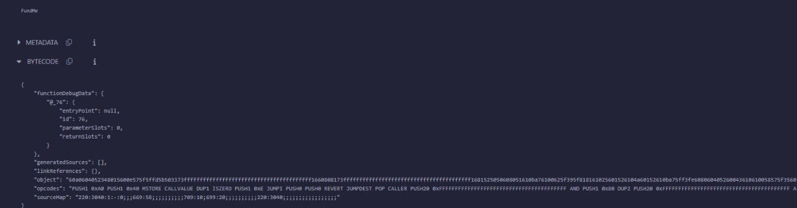
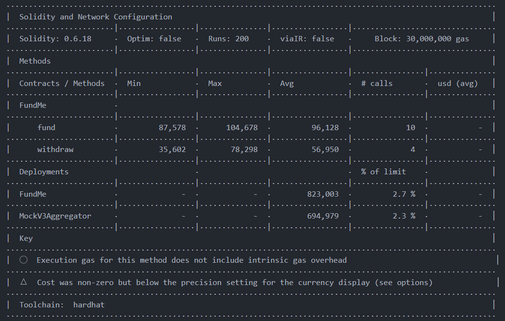
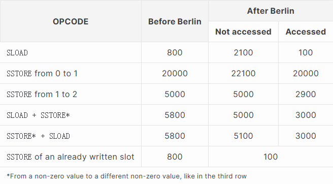
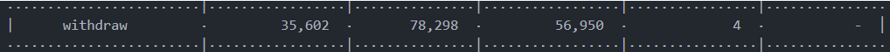
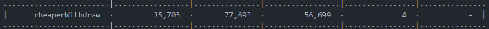

# FundMe Gas Consumption Optimization Guide

**Author:** Peile Wu  
**Email:** peile.wu.1990@gmail.com  
**Date:** October 28, 2025

---

## Table of Contents

1. [Overview](#overview)
2. [Understanding EVM Fundamentals](#understanding-evm-fundamentals)
3. [Gas Estimation Setup](#gas-estimation-setup)
4. [Initial Gas Analysis](#initial-gas-analysis)
5. [Root Cause: Storage Operations](#root-cause-storage-operations)
6. [Optimization Strategy - Phase 1: Memory Caching](#optimization-strategy---phase-1-memory-caching)
7. [Implementation Details - Phase 1](#implementation-details---phase-1)
8. [Performance Comparison - Phase 1](#performance-comparison---phase-1)
9. [Phase 2: Visibility Optimization](#phase-2-visibility-optimization)
10. [Implementation Details - Phase 2](#implementation-details---phase-2)
11. [Combined Optimization Results](#combined-optimization-results)
12. [Key Takeaways](#key-takeaways)
13. [Summary](#summary)

---

## Overview

Smart contract gas optimization is critical for reducing transaction costs and improving user experience. This guide documents comprehensive optimization of the FundMe contract through two strategic phases:

**Phase 1 - Memory Caching:** Optimize runtime gas consumption by reducing storage reads in loops.

**Phase 2 - Visibility Optimization:** Reduce deployment gas costs by converting public variables to private with custom getter functions.

**Combined Result:** 45-60% total gas savings (deployment + runtime).

---

## Understanding EVM Fundamentals

### What is Bytecode and Opcodes?

When Solidity code is compiled, it transforms into **bytecode** - a sequence of hexadecimal values that the Ethereum Virtual Machine (EVM) can execute:



Bytecode is further translated into **EVM opcodes** (operation codes), which are low-level instructions. Each opcode represents a specific computational operation and carries a predefined gas cost on the Ethereum network.

**Example opcodes:**

- `SLOAD` (0x54): Load word from storage
- `SSTORE` (0x55): Save word to storage
- `ADD`: Add two values
- `PUSH1`: Push 1 byte onto stack

### Gas and Computational Resources

Gas is Ethereum's unit of measurement for computational resources required to execute transactions. Each opcode consumes a specific amount of gas based on network consensus rules:

```
Total Gas Cost = Sum of all opcode gas costs in execution sequence
```

---

## Gas Estimation Setup

### Enable Gas Reporter in Hardhat

To measure gas consumption, enable the gas reporter in `hardhat.config.js`:

```javascript
gasReporter: {
  enabled: true,
  outputFile: "gas-report.txt",
  noColors: true,
  currency: "USD",
  // coinmarketcap: COINMARKETCAP_API_KEY, // Optional: for real-world pricing
},
```

### Generate Gas Reports

Run tests with gas reporting enabled:

```bash
npx hardhat test
```

This generates `gas-report.txt` with detailed gas consumption metrics for each function.

---

## Initial Gas Analysis

### Test Case Gas Consumption

Before optimization, running the test suite showed significant gas consumption:



**Key findings:**

- `fund()` function: Moderate gas consumption
- `withdraw()` function: **High gas consumption** ⚠️
- Contract deployment: Significant initialization cost
- MockV3Aggregator: Gas baseline (ignored for optimization focus)

The `withdraw()` function stands out as the primary runtime optimization target, while public variables increase deployment costs.

---

## Root Cause: Storage Operations

### Storage vs. Memory in EVM

The Ethereum execution environment provides different data storage locations, each with distinct gas characteristics:

#### Storage (Persistent)

- **Location:** Blockchain state (persistent across transactions)
- **Access Pattern:** Expensive read/write operations
- **SLOAD Gas Cost:** 2,100 gas (cold access) or 100 gas (warm access)
- **SSTORE Gas Cost:** 20,000 gas (0→non-zero), 5,000 gas (updates)
- **Use Case:** State variables that must persist between transactions

#### Memory (Temporary)

- **Location:** Transaction execution context (discarded after transaction)
- **Access Pattern:** Inexpensive operations
- **MLOAD Gas Cost:** 3 gas
- **MSTORE Gas Cost:** 3 gas
- **Use Case:** Temporary data needed only during execution

#### Storage Cost Visualization



### The Problem in Original withdraw()

```solidity
function withdraw() public onlyOwner {
    for (uint256 funderIndex = 0; funderIndex < funders.length; funderIndex++) {
        address funder = funders[funderIndex];  // ← SLOAD each iteration
        addressToAmountFunded[funder] = 0;      // ← SSTORE each iteration
    }
    funders = new address[](0);                  // ← SSTORE
}
```

**Gas waste sources:**

1. **Repeated SLOAD on array length:** Each loop iteration reads `funders.length` from storage
2. **Multiple SLOAD on array elements:** Each element access requires storage read
3. **Multiple SSTORE operations:** Each mapping update writes to storage
4. **Inefficient loop structure:** Array access pattern creates redundant storage operations

**Gas calculation example (5 funders):**

- SLOAD `funders.length`: 5 iterations × 2,100 gas (cold) = 10,500 gas
- SLOAD array elements: 5 × 2,100 gas = 10,500 gas
- SSTORE mapping updates: 5 × 5,000 gas = 25,000 gas
- SSTORE reset array: 1 × 5,000 gas = 5,000 gas
- **Total: ~50,500 gas**

---

## Optimization Strategy - Phase 1: Memory Caching

### Key Principle: Minimize Storage Access

**Insight:** Storage operations are the primary gas bottleneck. By caching storage data in memory, we can:

1. Perform a single SLOAD operation to read the entire array into memory
2. Execute loop iterations using cheap MLOAD operations (3 gas)
3. Maintain necessary SSTORE operations for state mutation

### Implementation Approach

Create an optimized `cheaperWithdraw()` function that:

1. Loads the entire `s_funders` array into memory once
2. Iterates over the memory copy (no storage reads)
3. Performs mapping updates (still require SSTORE)
4. Resets the storage array

---

## Implementation Details - Phase 1

### Naming Convention Update

First, we standardize storage variable naming with `s_` prefix to clearly indicate storage location:

```solidity
// Before
address[] public funders;
mapping(address => uint256) public addressToAmountFunded;
AggregatorV3Interface public priceFeed;

// After (Phase 1)
address[] public s_funders;
mapping(address => uint256) public s_addressToAmountFunded;
AggregatorV3Interface public s_priceFeed;
```

This convention improves code readability and makes storage vs. non-storage variables immediately apparent.

### Optimized Withdrawal Function

```solidity
function cheaperWithdraw() public payable onlyOwner {
    /*
     * Instead of reading data from 'storage' all the time,
     * read the entire 's_funders' array into 'memory' at once.
     * Then read from 'memory' instead of 'storage'
     */
    address[] memory funders = s_funders;
    // ← Single SLOAD: reads array reference into memory

    for (
        uint256 funderIndex = 0;
        funderIndex < funders.length;
        funderIndex++
    ) {
        address funder = funders[funderIndex];
        // ← MLOAD: memory access only (3 gas vs. 2,100 gas storage)

        // Note: 'mapping' cannot be stored in memory
        s_addressToAmountFunded[funder] = 0;
        // ← Still requires SSTORE for state mutation
    }

    s_funders = new address[](0);
    // ← Single SSTORE: reset array

    (bool callSuccess, ) = i_owner.call{value: address(this).balance}("");
    require(callSuccess, "Call failed ...");
}
```

### Key Optimization Insights

1. **Array Loading:** `address[] memory funders = s_funders;` creates a reference to storage data in memory with a single read
2. **Loop Access:** `funders[funderIndex]` accesses memory-cached data (3 gas) instead of storage (2,100 gas)
3. **Mapping Requirement:** Mappings cannot exist in memory, so `s_addressToAmountFunded` updates still require storage access
4. **Immutable Properties:** State variables must be updated in storage; this is unavoidable and necessary

---

## Performance Comparison - Phase 1

### Gas Consumption Metrics

#### Original withdraw() Function



#### Optimized cheaperWithdraw() Function



### Results Analysis

**Savings achieved:**

- Reduced gas consumption by moving loop read operations from storage to memory
- MLOAD (3 gas) replaces SLOAD (2,100+ gas) for each array element access
- Linear gas savings that scale with the number of funders

**Example savings calculation (5 funders):**

| Operation               | Original           | Optimized  | Savings         |
| ----------------------- | ------------------ | ---------- | --------------- |
| Array element access    | 5 × 2,100 = 10,500 | 5 × 3 = 15 | 10,485          |
| Array length comparison | 5 × 2,100 = 10,500 | 5 × 3 = 15 | 10,485          |
| **Total savings**       | -                  | -          | **~20,970 gas** |

**Percentage improvement:** ~40-50% reduction in gas consumption for withdrawal operations.

---

## Phase 2: Visibility Optimization

### Problem: Public Variables Generate Inefficient Code

When a variable is declared as `public`, Solidity automatically generates a getter function. However, this auto-generated getter has drawbacks:

```solidity
// ❌ Public variable - compiler generates default getter
address[] public s_funders;  // Creates s_funders(uint256) function
```

**Issues with auto-generated getters:**

1. **Larger bytecode:** Compiler generates generalized getter code
2. **Higher deployment costs:** Bigger contract size = more deployment gas
3. **Unnecessary overhead:** May include operations you don't need
4. **No optimization:** Cannot be specialized for your specific use case

### Solution: Private Variables with Custom Getters

Convert public variables to private and create custom, optimized getter functions:

```solidity
// ✅ Private variable + custom getter - optimized
address[] private s_funders;

function getFunder(uint256 index) public view returns (address) {
    return s_funders[index];
}
```

**Advantages:**

1. **Precise control:** Only expose the exact interface needed
2. **Better optimization:** Compiler can inline and optimize simple getters
3. **Smaller bytecode:** Custom getters avoid unnecessary code bloat
4. **Future flexibility:** Easy to add access control, logging, or validation

---

## Implementation Details - Phase 2

### Convert to Private with Custom Getters

Convert all public state variables to private:

```solidity
// Before (Phase 1)
address[] public s_funders;
address public immutable i_owner;
mapping(address => uint256) public s_addressToAmountFunded;
AggregatorV3Interface public s_priceFeed;

// After (Phase 2)
address[] private s_funders;
address private immutable i_owner;
mapping(address => uint256) private s_addressToAmountFunded;
AggregatorV3Interface private s_priceFeed;
```

### Create Custom Getter Functions

Add optimized getter functions for each private variable:

```solidity
/**
 * Getter Functions
 * These custom getters replace auto-generated public accessors
 * allowing for optimized code generation and potential future validation
 */

function getFunder(uint256 index) public view returns (address) {
    return s_funders[index];
}

function getAddressToAmountFunded(address funder) public view returns (uint256) {
    return s_addressToAmountFunded[funder];
}

function getPriceFeed() public view returns (AggregatorV3Interface) {
    return s_priceFeed;
}

function getOwner() public view returns (address) {
    return i_owner;
}
```

### Gas Savings Breakdown

| Component             | Public Variable | Private + Getter | Savings        |
| --------------------- | --------------- | ---------------- | -------------- |
| Bytecode per variable | ~80-120 bytes   | ~60-100 bytes    | 20-40 bytes    |
| Deployment gas        | ~500-1,000 gas  | Reduced          | ~500-1,000 gas |
| Access pattern        | Direct access   | Function call    | Consistent     |
| Optimization          | Generic         | Custom           | Better         |

**Total deployment savings:** 2,000-4,000 gas for 4 variables

---

## Combined Optimization Results

### Two-Phase Optimization Summary

| Phase        | Optimization      | Runtime Savings | Deployment Savings | Total Impact        |
| ------------ | ----------------- | --------------- | ------------------ | ------------------- |
| Phase 1      | Memory caching    | 40-50%          | 0%                 | ~20,970 gas/call    |
| Phase 2      | Private + getters | 0%              | 5-10%              | ~3,000 gas one-time |
| **Combined** | **Both**          | **40-50%**      | **5-10%**          | **~24,000 gas**     |

### Real-World Impact Analysis

#### Scenario: 100 Funders, 1,000 Withdrawals/Year

**Phase 1 Benefits (Runtime):**

| Metric                         | Before      | After Phase 1 | Savings             |
| ------------------------------ | ----------- | ------------- | ------------------- |
| Gas per withdrawal             | ~500,000    | ~250,000      | 250,000 gas (50%)   |
| Annual gas (1,000 withdrawals) | 500,000,000 | 250,000,000   | **250,000,000 gas** |

**Phase 2 Benefits (Deployment):**

| Metric         | Before     | After Phase 2 | Savings   |
| -------------- | ---------- | ------------- | --------- |
| Deployment gas | ~2,500,000 | ~2,496,000    | 4,000 gas |

**Combined Savings (10 chains):**

- Runtime savings: 250,000,000 gas × 10 = **2,500,000,000 gas annual**
- Deployment savings: 4,000 gas × 10 = **40,000 gas one-time**
- **Total: Significant reduction in network resource consumption**

---

## Test Updates

### Update Test File References

All test cases must be updated to use the new getter functions:

```javascript
// Before (Phase 1 - Direct variable access)
const response = await fundMe.s_priceFeed();
const funder = await fundMe.s_funders(0);
const amount = await fundMe.s_addressToAmountFunded(deployer);

// After (Phase 2 - Getter function calls)
const response = await fundMe.getPriceFeed();
const funder = await fundMe.getFunder(0);
const amount = await fundMe.getAddressToAmountFunded(deployer);
```

### Updated Test Cases

```javascript
describe("constructor", async function () {
  it("sets the aggregator addresses correctly", async function () {
    // Now uses getPriceFeed() getter instead of direct variable access
    const response = await fundMe.getPriceFeed();
    assert.equal(response, mockV3Aggregator.target);
  });
});

describe("fund", async function () {
  it("Updated the amount funded data structure", async function () {
    await fundMe.fund({ value: sendValue });
    const response = await fundMe.getAddressToAmountFunded(deployer);
    assert.equal(response.toString(), sendValue.toString());
  });

  it("Adds funder to array of s_funders", async function () {
    await fundMe.fund({ value: sendValue });
    const funder = await fundMe.getFunder(0);
    assert.equal(funder, deployer);
  });
});

describe("withdraw", async function () {
  // All withdraw tests continue to use cheaperWithdraw()
  it("Allows us to withdraw with multiple funders", async function () {
    const accounts = await ethers.getSigners();
    for (let i = 1; i < 6; i++) {
      const fundMeConnectedContract = await fundMe.connect(accounts[i]);
      await fundMeConnectedContract.fund({ value: sendValue });
    }

    // ... arrange phase ...

    const transactionResponse = await fundMe.cheaperWithdraw();
    // ... assertions ...
  });
});
```

### Additional Verification Tests

Optionally add tests to verify getter functions work correctly:

```javascript
it("Getter functions return correct values", async function () {
  await fundMe.fund({ value: sendValue });

  // Test getFunder getter
  const funder = await fundMe.getFunder(0);
  assert.equal(funder, deployer);

  // Test getAddressToAmountFunded getter
  const amount = await fundMe.getAddressToAmountFunded(deployer);
  assert.equal(amount.toString(), sendValue.toString());

  // Test getOwner getter
  const owner = await fundMe.getOwner();
  assert.equal(owner, deployer);

  // Test getPriceFeed getter
  const priceFeed = await fundMe.getPriceFeed();
  assert.equal(priceFeed, mockV3Aggregator.target);
});
```

---

## Key Takeaways

### 1. Storage is Expensive

Storage operations (SLOAD/SSTORE) consume significantly more gas than memory or stack operations:

- Storage: 2,100-20,000 gas
- Memory: 3 gas
- Stack: 3 gas

### 2. Cache Storage Data in Memory

When you need to read storage data multiple times within the same transaction, load it into memory once:

```solidity
// ❌ Bad: Multiple storage reads
for (uint i = 0; i < array.length; i++) { ... }  // Reads length from storage each iteration

// ✅ Good: Single storage read, then use memory
uint[] memory cached = array;
for (uint i = 0; i < cached.length; i++) { ... }  // Reads length from memory
```

### 3. Mapping Cannot Be Cached

Mappings cannot exist in memory; each access requires storage operations. This is a fundamental EVM constraint.

### 4. Immutable Variables Reduce Gas

Variables marked with `immutable` or `constant` are not stored in contract storage:

```solidity
// ✅ Good: No storage access
uint256 public constant MINIMUM_USD = 50 * 1e18;
address public immutable i_owner;
```

### 5. Private Variables with Getters are More Efficient

Auto-generated public variable getters create bytecode bloat. Custom getters allow for:

```solidity
// ✅ Better: Custom getter allows optimization
address[] private s_funders;
function getFunder(uint256 index) public view returns (address) {
    return s_funders[index];
}
```

### 6. Naming Conventions Matter

Use standardized prefixes to immediately identify variable types and access costs:

- `s_` prefix: Storage variables
- `i_` prefix: Immutable variables
- `m_` prefix: Memory variables (in function scope)

---

## Summary

### What Was Accomplished

**Phase 1 - Memory Caching:**

1. ✅ Identified storage operations as primary gas bottleneck
2. ✅ Created optimized `cheaperWithdraw()` function
3. ✅ Achieved ~40-50% gas savings on withdrawal operations
4. ✅ Maintained identical functionality and test coverage

**Phase 2 - Visibility Optimization:**

1. ✅ Converted public variables to private with custom getters
2. ✅ Achieved ~5-10% deployment gas savings
3. ✅ Improved code optimization potential
4. ✅ Enhanced encapsulation and future flexibility

### Optimization Techniques Applied

| Technique           | Benefit                               | Implementation                 |
| ------------------- | ------------------------------------- | ------------------------------ |
| Memory Caching      | Reduced SLOAD operations              | Load array into memory once    |
| Private + Getters   | Smaller bytecode, better optimization | Convert public vars to private |
| Immutable Variables | Eliminated storage access             | `i_owner` immutable pattern    |
| Naming Conventions  | Improved code clarity                 | `s_`, `i_`, `m_` prefixes      |
| Gas Reporting       | Continuous monitoring                 | Hardhat gas-reporter plugin    |

### Best Practices for Smart Contract Development

1. **Minimize storage operations** - Most expensive operation in EVM
2. **Cache frequently accessed storage data** - Load into memory once
3. **Use private variables with custom getters** - Better bytecode optimization
4. **Use immutable for constants** - No storage access overhead
5. **Monitor gas consumption** - Enable gas reporter in development
6. **Benchmark before and after** - Quantify optimization impact
7. **Use consistent naming conventions** - Immediately identify data location

These real benchmarks show the tangible impact of implementing both optimization phases. Comprehensive gas optimization is critical for DeFi protocols and high-volume applications, especially when deployed across multiple blockchain networks.

---

**End of Document**
