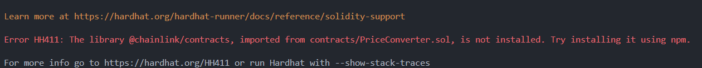
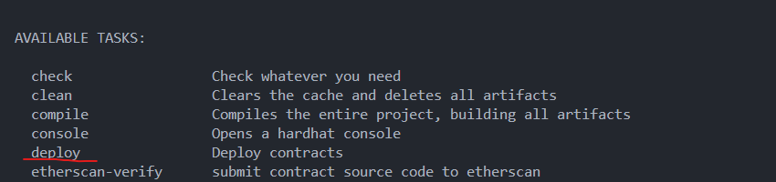
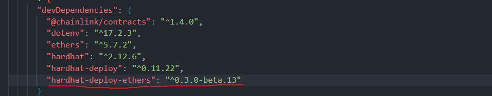
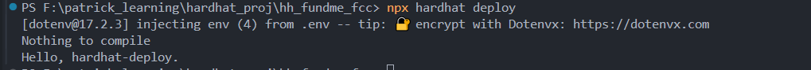
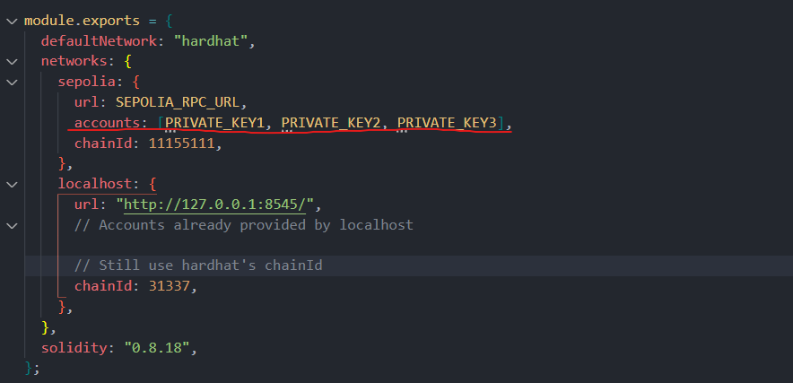

# FundMe Project with Hardhat-Deploy

**Author:** Peile Wu  
**Email:** peile.wu.1990@gmail.com  
**Date:** October 24, 2025

---

## Overview

This guide walks you through building a FundMe smart contract project using Hardhat 2.12.6 with hardhat-deploy for professional deployment management. The project demonstrates fund collection with price validation using Chainlink oracles.

---

## Part 1: Environment Setup

### Prerequisites

Before starting, ensure you have the right Node.js version:

```bash
nvm install 18
nvm use 18.20.8
```

### Clean Your Project Directory

If you're reusing a directory, remove all previous configurations:

```bash
rm -rf node_modules package-lock.json yarn.lock package.json
```

### Install Hardhat 2.12.6

Use npm with the Chinese mirror for faster installation:

```bash
npm install --save-dev hardhat@2.12.6 --registry https://registry.npmmirror.com
```

### Initialize Hardhat Project

Create a new JavaScript project:

```bash
npx hardhat
# Select: Create a JavaScript project
# Choose defaults for other options
```

### Configure hardhat.config.js

Remove the hardhat-toolbox requirement (not compatible with this version):

```javascript
// Delete this line:
// require("@nomicfoundation/hardhat-toolbox");

require("dotenv").config();

module.exports = {
  solidity: "0.8.18",
};
```

---

## Part 2: Smart Contracts

### Contract Structure

Your project includes two contracts:

**FundMe.sol** - Main funding contract

- Accepts ETH from users
- Validates minimum fund amount ($50 USD)
- Only owner can withdraw funds

**PriceConverter.sol** - Library for price conversion

- Fetches ETH/USD price from Chainlink oracle
- Converts ETH amounts to USD

### Install Chainlink Contracts

The contracts depend on Chainlink interfaces:

```bash
npm install --save-dev @chainlink/contracts --registry https://registry.npmmirror.com
```

### Compile Contracts

```bash
npx hardhat compile
```

Make sure your `solidity` version in `hardhat.config.js` matches or is higher than the contract pragma version.



---

## Part 3: Understanding Hardhat-Deploy

### Why Use Hardhat-Deploy?

Manual deployment scripts have several problems:

**Problem 1: Lost Deployment Records**

- Contract addresses and deployment time disappear after each deploy
- Hard to track which contracts are already deployed

**Problem 2: Repeated Deployments**

- No way to know which contracts already exist
- Risk of deploying the same contract multiple times

**Problem 3: Testing & Deployment Mismatch**

- Tests need contracts deployed
- Deployment scripts also deploy contracts
- Two separate systems, lots of duplicate code

**Problem 4: Multi-Chain Complexity**

- Deploying to local network, testnet, and mainnet requires different logic
- Hard to manage across multiple networks

### How Hardhat-Deploy Solves These

✓ **Automatically saves deployment info** (address, parameters, timestamp)  
✓ **Skips already-deployed contracts** (conditional deployment)  
✓ **Unified interface** for testing and deployment  
✓ **Easy multi-network management**

---

## Part 4: Installing Hardhat-Deploy

### Step 1: Install Core Packages

These three packages work together as a verified combination for Hardhat 2.12.6:

```bash
npm install --save-dev ethers@5.7.2 hardhat-deploy@0.11.22 hardhat-deploy-ethers@0.3.0-beta.13 --registry https://registry.npmmirror.com
```

### Step 2: Understand Each Package

**ethers@5.7.2**

- Library for interacting with smart contracts
- Reads contract state, sends transactions
- Version 5.x is for Hardhat 2.x (version 6.x is for Hardhat 3.x)

**hardhat-deploy@0.11.22**

- Hardhat plugin for professional deployment management
- Saves deployment records automatically
- Enables conditional deployment (skip already-deployed contracts)
- Latest stable version for Hardhat 2.x

**hardhat-deploy-ethers@0.3.0-beta.13**

- Bridge between hardhat-deploy and ethers.js
- Lets deploy scripts use ethers functions
- Must match the versions above to avoid conflicts

### Step 3: Enable in hardhat.config.js

```javascript
require("hardhat-deploy-ethers");
```

Add this to your `hardhat.config.js` configuration file.

### Step 4: Verify Installation

```bash
npx hardhat
```

You should see a `deploy` task in the available tasks list.



---

## Part 5: How hardhat-deploy and hardhat-deploy-ethers Work Together

Think of them as a team:

```
┌─────────────────────────────────────────┐
│  hardhat-deploy (Deployment Manager)    │
│  - Provides 'deploy' command            │
│  - Saves deployment records             │
│  - Manages multiple networks            │
│  - Provides deploy() function           │
└──────────────────┬──────────────────────┘
                   ↓ needs
┌─────────────────────────────────────────┐
│  hardhat-deploy-ethers (Bridge)         │
│  - Enables ethers.js usage in scripts   │
│  - Provides ethers object               │
│  - Connects deploy manager to blockchain│
└──────────────────┬──────────────────────┘
                   ↓ needs
┌─────────────────────────────────────────┐
│  ethers.js (Blockchain Interaction)     │
│  - Actually communicates with blockchain│
│  - Sends transactions                   │
│  - Reads contract state                 │
└─────────────────────────────────────────┘
```

**In your package.json:**

```json
{
  "devDependencies": {
    "ethers": "^5.7.2",
    "hardhat": "^2.12.6",
    "hardhat-deploy": "^0.11.22",
    "hardhat-deploy-ethers": "^0.3.0-beta.13"
  }
}
```



---

## Part 6: Creating Deploy Scripts

### Directory Structure

Hardhat-deploy looks for scripts in the `deploy/` directory:

```
project/
├── deploy/
│   └── 01-deploy-fund-me.js    ← Deploy scripts go here
├── contracts/
│   ├── FundMe.sol
│   └── PriceConverter.sol
└── hardhat.config.js
```

### Naming Convention

Number your scripts to control execution order:

- `01-deploy-fund-me.js` - Runs first
- `02-verify-contract.js` - Runs second
- etc.

### Basic Deploy Script Structure

Create `deploy/01-deploy-fund-me.js`:

```javascript
module.exports = async ({ getNamedAccounts, deployments }) => {
  const { deploy, log } = deployments;
  const { deployer } = await getNamedAccounts();

  log("Deploying FundMe...");

  const fundMe = await deploy("FundMe", {
    from: deployer,
    log: true,
  });

  log(`FundMe deployed to: ${fundMe.address}`);
};

module.exports.tags = ["all", "fundme"];
```

### Understanding the Script

**`getNamedAccounts`** - Gets named accounts from hardhat.config.js  
**`deployments`** - Object containing deploy() and log() functions  
**`deploy(contractName, options)`** - Deploys contract with specified options  
**`log: true`** - Prints deployment info to console

### Running Deploy Scripts

```bash
npx hardhat deploy
```

All scripts in the `deploy/` directory will execute in order.



---

## Part 7: Setting Up Named Accounts

Instead of using account indices like `accounts[0]`, use named accounts:

**In hardhat.config.js:**

```javascript
module.exports = {
  solidity: "0.8.18",
  namedAccounts: {
    deployer: {
      default: 0, // Use first account as deployer
    },
  },
  networks: {
    sepolia: {
      url: process.env.SEPOLIA_RPC_URL,
      accounts: [process.env.PRIVATE_KEY],
      chainId: 11155111,
    },
  },
};
```



**In your deploy script:**

```javascript
const { deployer } = await getNamedAccounts();
// Now you can use 'deployer' instead of remembering account indices
```

---

## Part 8: Command Reference

| Command                            | Purpose                        |
| ---------------------------------- | ------------------------------ |
| `npx hardhat compile`              | Compile contracts              |
| `npx hardhat deploy`               | Run all deploy scripts         |
| `npx hardhat deploy --tags fundme` | Run scripts tagged as 'fundme' |
| `npx hardhat test`                 | Run tests                      |
| `npx hardhat node`                 | Start local network            |

---

## Common Errors & Solutions

**Error: Cannot find module '@chainlink/contracts'**

```bash
npm install --save-dev @chainlink/contracts --registry https://registry.npmmirror.com
```

**Error: Solidity version mismatch**

- Ensure `hardhat.config.js` solidity version ≥ contract pragma version

**Error: Deploy command not found**

- Add `require("hardhat-deploy");` to hardhat.config.js

---

## Project Structure

```
hh_fundme_fc/
├── contracts/
│   ├── FundMe.sol
│   └── PriceConverter.sol
├── deploy/
│   └── 01-deploy-fund-me.js
├── test/
├── artifacts/
├── hardhat.config.js
├── package.json
└── .env
```

---

## Next Steps

1. Write your deploy script in `deploy/01-deploy-fund-me.js`
2. Add network configuration to `hardhat.config.js`
3. Create `.env` file with `SEPOLIA_RPC_URL` and `PRIVATE_KEY`
4. Run `npx hardhat deploy` to deploy your contracts
5. Deployment records are saved automatically in `deployments/` directory

---

## Resources

- [Hardhat Documentation](https://hardhat.org/docs)
- [Hardhat-Deploy GitHub](https://github.com/wighawag/hardhat-deploy)
- [Ethers.js Documentation](https://docs.ethers.org/v5/)
- [Chainlink Data Feeds](https://docs.chain.link/data-feeds)

---

**Note:** This is an educational project. Always test thoroughly on testnet before mainnet deployment.
