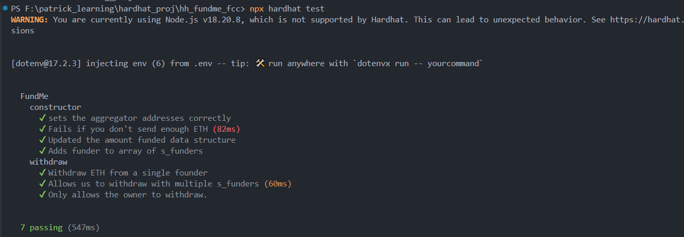
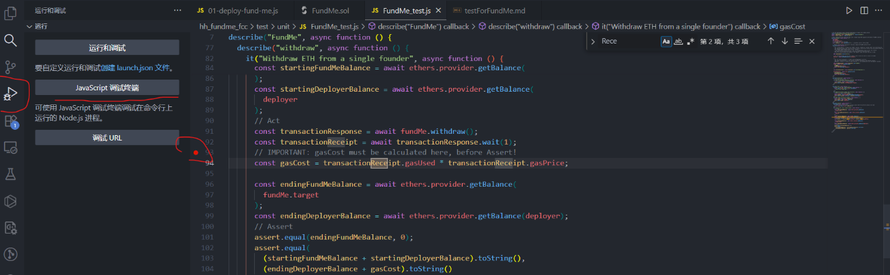
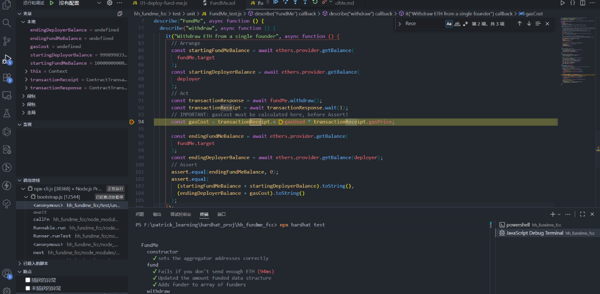
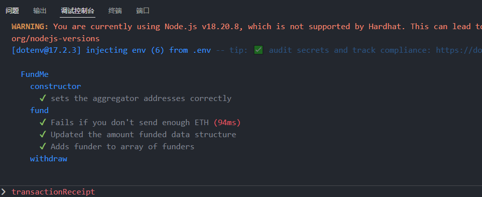
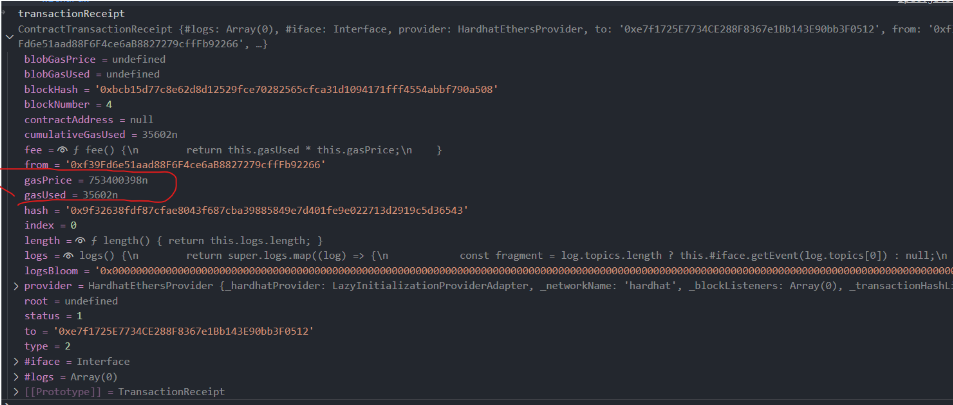
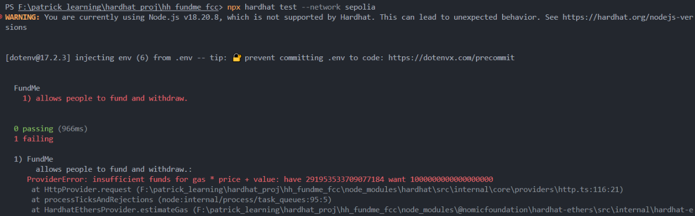
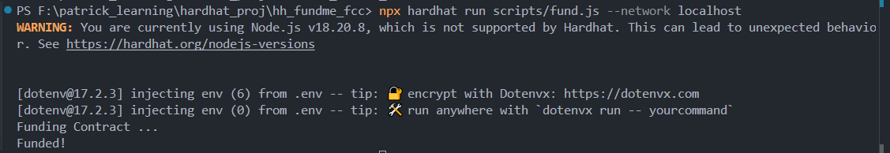
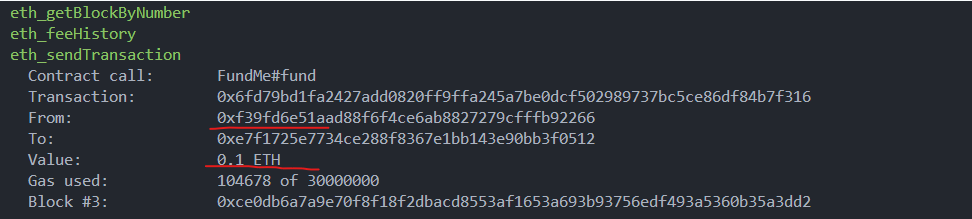
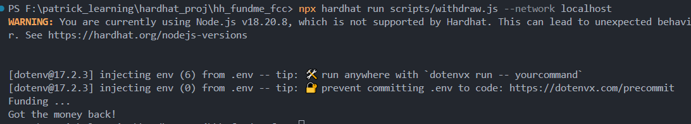
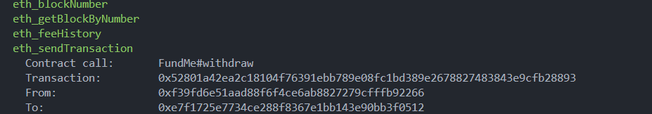

# FundMe Contract Testing Guide

**Author:** Peile Wu  
**Email:** peile.wu.1990@gmail.com  
**Date:** October 29, 2025

---

## Table of Contents

1. [Overview](#overview)
2. [Project Structure](#project-structure)
3. [Setup and Installation](#setup-and-installation)
4. [Testing Framework](#testing-framework)
5. [Part 1: Unit Tests](#part-1-unit-tests)
   - [Test Execution Flow](#test-execution-flow)
   - [Test Cases](#test-cases)
   - [Withdraw Test - Detailed Breakdown](#withdraw-test---detailed-breakdown)
   - [Running Unit Tests](#running-unit-tests)
6. [Part 2: Staging Tests](#part-2-staging-tests)
   - [Staging Test Overview](#staging-test-overview)
   - [Creating Staging Test File](#creating-staging-test-file)
   - [Unit Test File Modification](#unit-test-file-modification)
   - [Running Staging Tests](#running-staging-tests)
   - [Creating Helper Scripts](#creating-helper-scripts)
   - [Fund Script](#fund-script)
   - [Withdraw Script](#withdraw-script)
   - [Testing on Localhost](#testing-on-localhost)
7. [Code Coverage](#code-coverage)
8. [Key API Changes (ethers v5 to v6)](#key-api-changes-ethers-v5-to-v6)
9. [Summary](#summary)

---

## Overview

Testing smart contracts is essential for optimization, gas efficiency, and security. This guide demonstrates comprehensive testing of the FundMe contract using two types of tests:

- **Unit Tests (UT):** Test individual code units locally on Hardhat
- **Staging Tests (ST):** Test on testnets before mainnet deployment

---

## Project Structure

Create the following directory structure in your project root:

```
hh_fundme_fcc/
├── contracts/
│   ├── FundMe.sol
│   ├── PriceConverter.sol
│   └── test/
│       └── MockV3Aggregator.sol
├── deploy/
│   ├── 00-deploy-mocks.js
│   └── 01-deploy-fundme.js
├── test/
│   ├── unit/
│   │   └── FundMe_test.js          ← Unit tests (local Hardhat)
│   └── staging/
│       └── FundMe_staging.js       ← Staging tests (testnet only)
├── scripts/
│   ├── fund.js
│   └── withdraw.js
├── img/
│   ├── Debug_with_Breakpoint/
│   └── StagingTest_FundMe/
├── hardhat.config.js
├── .env
└── package.json
```

**Key Point:** Always run `npx hardhat test` from the **project root** directory, not from subdirectories.

---

## Setup and Installation

### 1. Initialize Project

```bash
npm init -y
npm install --save-dev hardhat
npx hardhat
```

### 2. Install Required Dependencies

```bash
npm install --save-dev \
  @nomiclabs/hardhat-etherscan \
  @nomicfoundation/hardhat-chai-matchers \
  @nomicfoundation/hardhat-ethers \
  dotenv \
  ethers \
  hardhat-deploy \
  hardhat-deploy-ethers \
  hardhat-gas-reporter \
  solidity-coverage \
  chai
```

### 3. Handle Version Conflicts

Since we're using **ethers v6** and **hardhat-deploy-ethers v0.3.0-beta.13** (which supports ethers v5), install with legacy peer dependencies:

```bash
npm install --legacy-peer-deps
```

---

## Testing Framework

### Required Libraries

#### 1. **@nomicfoundation/hardhat-chai-matchers**

This replaces the deprecated Waffle library for advanced assertions.

**Installation:**

```bash
npm install --save-dev @nomicfoundation/hardhat-chai-matchers
```

**Configuration in hardhat.config.js:**

```javascript
require("@nomicfoundation/hardhat-chai-matchers");
```

**Import in test file:**

```javascript
const { assert, expect } = require("chai");
require("@nomicfoundation/hardhat-chai-matchers");
```

#### 2. **hardhat-deploy**

Manages smart contract deployments with fixtures for testing.

**Key functions:**

- `deployments.fixture(["all"])` - Deploy all contracts with "all" tag
- `deployments.get("ContractName")` - Get contract deployment info
- `ethers.getContractAt()` - Connect to deployed contracts

#### 3. **ethers v6**

JavaScript SDK for Ethereum interaction. API differs significantly from v5.

---

# Part 1: Unit Tests

## Test Execution Flow

Understanding when different phases occur is crucial. Here's the complete flow:

### Phase 1: Contract Deployment – in `beforeEach`

```javascript
beforeEach(async function () {
  // Step 1: Deploy all contracts
  await deployments.fixture(["all"]); // ← Constructor runs here

  // Step 2: Get deployer account
  deployer = (await getNamedAccounts()).deployer;

  // Step 3: Get FundMe contract and connect to it
  const FundMeDeployment = await deployments.get("FundMe");
  fundMe = await ethers.getContractAt(
    "FundMe",
    FundMeDeployment.address,
    await ethers.getSigner(deployer)
  );
  // ← Now fundMe is a contract instance we can call functions on

  // Step 4: Get MockV3Aggregator contract
  const MockV3Deployment = await deployments.get("MockV3Aggregator");
  mockV3Aggregator = await ethers.getContractAt(
    "MockV3Aggregator",
    MockV3Deployment.address,
    await ethers.getSigner(deployer)
  );
});
```

**What happens in this phase:**

- `deployments.fixture(["all"])` deploys all contracts from `/deploy` folder
- Contract constructors execute during deployment
- We retrieve deployed contract addresses
- We create contract instances to interact with

**Timeline:** This runs **before each test**, so every test gets fresh contracts

### Phase 2: Contract Interaction (Function Calls) – in `it()` blocks

**Example 1: Testing the fund() function**

```javascript
it("Updated the amount funded data structure", async function () {
  // INTERACT: Call the fund() function on the contract
  await fundMe.fund({ value: sendValue });

  // INTERACT: Read the mapping to verify data was stored
  const response = await fundMe.addressToAmountFunded(deployer);

  // VERIFY: Assert the result matches what we sent
  assert.equal(response.toString(), sendValue.toString());
});
```

**What happens:**

1. `fundMe.fund({ value: sendValue })` - Calls contract's fund function and sends 1 ETH
2. `fundMe.addressToAmountFunded(deployer)` - Reads the mapping to verify ETH amount was recorded
3. `assert.equal()` - Verifies the recorded amount equals what was sent

**Example 2: Testing the withdraw() function**

```javascript
it("Withdraw ETH from a single founder", async function () {
  // INTERACT: Call the withdraw() function
  const transactionResponse = await fundMe.withdraw();
  const transactionReceipt = await transactionResponse.wait(1);

  // VERIFY: Check if contract balance is now 0
  const endingFundMeBalance = await ethers.provider.getBalance(fundMe.target);
  assert.equal(endingFundMeBalance, 0);
});
```

**What happens:**

1. `fundMe.withdraw()` - Calls the contract's withdraw function
2. `.wait(1)` - Waits for 1 block confirmation
3. `ethers.provider.getBalance()` - Reads the contract's ETH balance
4. `assert.equal()` - Verifies the balance is now 0

### Complete Test Execution Timeline

```
beforeEach()
  ↓
  [Deploy contracts with deployments.fixture()]
  [Constructor runs automatically]
  [Connect to contract instances]
  ↓
it("test case 1")
  ↓
  [Call contract functions: fundMe.fund()]
  [Read contract state: fundMe.addressToAmountFunded()]
  [Verify with assertions]
  ↓
beforeEach()  ← Runs again! Fresh contracts deployed
  ↓
  [Deploy contracts again]
  ↓
it("test case 2")
  ↓
  [Call different contract functions: fundMe.withdraw()]
  [Verify results]
```

**Key Points:**

- **Deployment** happens in `beforeEach()` - `deployments.fixture()` and `ethers.getContractAt()`
- **Function Calls** happen in `it()` blocks - `fundMe.fund()`, `fundMe.withdraw()`, etc.
- **Constructor** executes automatically during `deployments.fixture()` in beforeEach
- Each test gets **fresh contracts** because `beforeEach()` runs before every test

---

## Test Cases

### Test 1: Constructor Tests

Verifies that the constructor correctly sets the price feed address.

```javascript
describe("constructor", async function () {
  it("sets the aggregator addresses correctly", async function () {
    // CONTRACT INTERACTION: Read from storage variable set by constructor
    const response = await fundMe.priceFeed();

    // VERIFICATION: Check if it matches the mock aggregator address
    assert.equal(response, mockV3Aggregator.target);
  });
});
```

---

### Test 2: Fund Function Tests

Tests the fund() function with various scenarios.

**Test 2a: Revert with insufficient ETH**

```javascript
it("Fails if you don't send enough ETH", async function () {
  // CONTRACT INTERACTION: Call fund() without sending value
  // This should trigger the require statement in the contract
  await expect(fundMe.fund()).to.be.revertedWith("Didn't send enough USD ...");
});
```

**Test 2b: Update funding data structure**

```javascript
const sendValue = ethers.parseEther("1");

it("Updated the amount funded data structure", async function () {
  // CONTRACT INTERACTION: Send 1 ETH to fund() function
  await fundMe.fund({ value: sendValue });

  // CONTRACT INTERACTION: Read the mapping to verify amount was recorded
  const response = await fundMe.addressToAmountFunded(deployer);

  // VERIFICATION: Check if recorded amount equals sent amount
  assert.equal(response.toString(), sendValue.toString());
});
```

**Test 2c: Add funder to array**

```javascript
it("Adds funder to array of funders", async function () {
  // CONTRACT INTERACTION: Send ETH to trigger fund() function
  await fundMe.fund({ value: sendValue });

  // CONTRACT INTERACTION: Read the funders array at index 0
  const funder = await fundMe.funders(0);

  // VERIFICATION: Verify that deployer address was added to the array
  assert.equal(funder, deployer);
});
```

---

## Withdraw Test - Detailed Breakdown

The withdraw test is more complex because it validates state changes before and after a transaction. Let's examine each step:

### Full Withdraw Test Code

```javascript
describe("withdraw", async function () {
  // Setup: Fund the contract before each withdraw test
  beforeEach(async function () {
    await fundMe.fund({ value: sendValue });
  });

  it("Withdraw ETH from a single founder", async function () {
    // ========== ARRANGE PHASE ==========
    // Get initial balances BEFORE withdrawal

    const startingFundMeBalance = await ethers.provider.getBalance(
      fundMe.target
    );
    // ← Reads how much ETH the contract currently holds
    // ← Expected: 1 ETH (from beforeEach setup)

    const startingDeployerBalance = await ethers.provider.getBalance(deployer);
    // ← Reads how much ETH the deployer account has BEFORE withdrawal
    // ← This includes gas costs the deployer has already spent

    // ========== ACT PHASE ==========
    // Execute the withdraw function

    const transactionResponse = await fundMe.withdraw();
    // ← Calls the withdraw() function on the contract
    // ← This transaction will:
    //   1. Transfer all ETH from contract to deployer
    //   2. Clear the funders array
    //   3. Reset all mapping values
    // ← Returns a transaction response object

    const transactionReceipt = await transactionResponse.wait(1);
    // ← Waits for 1 block confirmation
    // ← Returns receipt with transaction details (gas used, etc)

    // Calculate gas cost of this transaction
    const gasCost = transactionReceipt.gasUsed * transactionReceipt.gasPrice;
    // ← Gas cost = amount of gas used × gas price per unit
    // ← Example: 50,000 gas × 20 gwei = cost in wei
    // ← This is what the deployer paid for the transaction

    // ========== ASSERT PHASE ==========
    // Get final balances AFTER withdrawal

    const endingFundMeBalance = await ethers.provider.getBalance(fundMe.target);
    // ← Reads how much ETH the contract holds NOW
    // ← Expected: 0 (all ETH was withdrawn)

    const endingDeployerBalance = await ethers.provider.getBalance(deployer);
    // ← Reads how much ETH the deployer has NOW
    // ← This is starting balance + 1 ETH received - gas cost paid

    // ========== VERIFICATION 1 ==========
    // Contract should be empty after withdrawal
    assert.equal(endingFundMeBalance, 0n);
    // ← Verifies that contract balance is exactly 0
    // ← If this fails, ETH is still locked in the contract

    // ========== VERIFICATION 2 ==========
    // Deployer should have received all funds minus gas cost
    assert.equal(
      (startingFundMeBalance + startingDeployerBalance).toString(),
      (endingDeployerBalance + gasCost).toString()
    );
    // ← Breaking this down:
    //   Left side:  Starting contract balance + Starting deployer balance
    //   Right side: Ending deployer balance + Gas cost paid
    //
    // ← In math terms:
    //   (ContractStart + DeployerStart) = DeployerEnd + GasCost
    //
    // ← Rearranged:
    //   ContractStart = DeployerEnd - DeployerStart + GasCost
    //   1 ETH = Received ETH + Gas spent
    //
    // ← This proves the deployer received the contract's ETH
    //   minus only the gas fees paid for the transaction
  });
});
```

### Visual Breakdown of Balance Changes

```
BEFORE WITHDRAW:
┌──────────────────────────┐
│ Contract:  1 ETH         │  ← From beforeEach: await fundMe.fund({ value: sendValue })
│ Deployer: X ETH          │
└──────────────────────────┘

WITHDRAW TRANSACTION:
  fundMe.withdraw()
    ↓
    [Transfer 1 ETH from contract to deployer]
    [Pay gas fee from deployer's balance]
    ↓

AFTER WITHDRAW:
┌──────────────────────────┐
│ Contract:  0 ETH         │  ← All withdrawn
│ Deployer: X + 1 - gasCost ETH  │  ← Gained 1 ETH, minus gas
└──────────────────────────┘

TEST VERIFIES:
✓ Contract balance is 0
✓ Deployer gained exactly 1 ETH minus gas cost
✓ No ETH was lost or gained unexpectedly
```

---

## Running Unit Tests

### Execute All Tests

```bash
npx hardhat test
```

**Expected Output:**



The output shows 7 unit tests running successfully on the local Hardhat network.

### Run Specific Test Suite

```bash
npx hardhat test --grep "constructor"
npx hardhat test --grep "fund"
npx hardhat test --grep "withdraw"
```

### Run with Coverage Report

```bash
npx hardhat coverage
```

### Debugging with Breakpoints

VSCode allows you to debug tests by setting breakpoints and inspecting variables during execution.

#### Step 1: Set Breakpoints in VSCode

Click on the line number in VSCode to set a breakpoint. A red dot will appear:



#### Step 2: Run Tests with Debugger

In the terminal, switch to your project directory and run:

```bash
npx hardhat test
```

The execution will pause at your breakpoint:



#### Step 3: Inspect Variables in Debug Console

In the debug console, type the variable name to inspect its contents. For example, type `transactionReceipt` to see transaction details:



#### Step 4: Find Gas Information

Look for gas-related fields in the transactionReceipt object. You'll see `gasUsed` and `gasPrice` (both are BigNumber types):



#### Calculating Gas Cost

Gas cost is calculated by multiplying gas used by gas price per unit:

```javascript
const gasCost = transactionReceipt.gasUsed * transactionReceipt.gasPrice;
// Example: 50,000 gas × 20 gwei = total gas cost in wei
```

This value represents the actual ETH paid for the transaction execution.

---

# Part 2: Staging Tests

## Staging Test Overview

Staging tests run on actual testnets (like Sepolia) to verify contract behavior in a real network environment before mainnet deployment. Unlike unit tests that use mocks, staging tests interact with the actual testnet infrastructure.

**Key differences from Unit Tests:**

| Aspect         | Unit Tests              | Staging Tests             |
| -------------- | ----------------------- | ------------------------- |
| **Network**    | Local Hardhat           | Testnet (Sepolia)         |
| **Price Feed** | MockV3Aggregator        | Real Chainlink feed       |
| **Speed**      | Very fast (~450ms)      | Slower (30+ seconds)      |
| **Cost**       | Free                    | Uses testnet ETH          |
| **Purpose**    | Development & debugging | Pre-deployment validation |

---

## Creating Staging Test File

Create the file `test/staging/FundMe.staging.test.js` with the following content:

```javascript
const { getNamedAccounts } = require("hardhat");

const { developmentChains } = require("../../helper-hardhat-config");

const { assert } = require("chai");

// Staging test only run on Testnet

developmentChains.includes(network.name)
  ? describe.skip
  : describe("FundMe", async function () {
      let fundMe;

      let deployer;

      const sendValue = ethers.parseEther("1");

      beforeEach(async function () {
        deployer = (await getNamedAccounts()).deployer;

        fundMe = await ethers.getContract("FundMe", deployer);
      });

      it("allows people to fund and withdraw.", async function () {
        await fundMe.fund({ value: sendValue });

        await fundMe.withdraw();

        const endingBalance = await ethers.provider.getBalance(fundMe.target);

        assert.equal(endingBalance.toString(), "0");
      });
    });
```

**Code Explanation:**

- **Line 1-2:** Import required modules

  - `getNamedAccounts`: Get accounts configured in hardhat.config.js
  - `developmentChains`: Array of development chain names from config
  - `assert`: Chai assertion library

- **Line 5-6:** Use ternary operator to conditionally skip/run tests

  - If `network.name` is in `developmentChains` → `describe.skip` (skip this test)
  - Otherwise → `describe` (run this test on testnet)

- **Line 8-27:** Test suite that only runs on testnet
  - `beforeEach`: Get deployer account and contract instance
  - `it`: Test fund and withdraw operations
  - `assert.equal`: Verify contract balance is 0 after withdrawal

---

## Unit Test File Modification

Update your `test/unit/FundMe_test.js` to only run on development chains:

Add this line before your `describe` block:

```javascript
!developmentChains.includes(network.name)
  ? describe.skip
  : describe("FundMe", async function () {
      // ... rest of your unit tests
    });
```

**Logic Explanation:**

- `!developmentChains.includes(network.name)`: If current network is NOT in development chains
- Then `describe.skip`: Skip the unit tests
- Else `:` run the unit tests normally

**Visual Representation:**

```
Unit Test Filter Logic:
┌─────────────────────────────────────┐
│ Is network a development chain?     │
├─────────────────────────────────────┤
│ YES (hardhat/localhost)             │
│  ↓ Run unit tests ✓                 │
│                                     │
│ NO (sepolia/mainnet)                │
│  ↓ Skip unit tests                  │
└─────────────────────────────────────┘


```

---

## Running Staging Tests

### On Local Hardhat Network

```bash
npx hardhat test
```

**Expected Output:**

Runs 7 unit tests successfully:


### On Testnet (Sepolia)

```bash
npx hardhat test --network sepolia
```

**Expected Output:**

Runs only 1 staging test. The test may fail if you don't have enough testnet ETH:



---

## Creating Helper Scripts

Helper scripts allow you to manually interact with the contract on any network. These complement automated tests.

---

## Fund Script

Create `scripts/fund.js` to send ETH to the FundMe contract:

```javascript
const { getNamedAccounts } = require("hardhat");

async function main() {
  const { deployer } = await getNamedAccounts();

  const fundMe = await ethers.getContract("FundMe", deployer);

  console.log("Funding Contract...");

  const transactionResponse = await fundMe.fund({
    value: ethers.parseEther("0.1"),
  });

  await transactionResponse.wait(1);

  console.log("Funded!");
}

main()
  .then(() => process.exit(0))

  .catch((error) => {
    console.error(error);

    process.exit(1);
  });
```

**What it does:**

1. Gets the deployer account from named accounts
2. Gets the deployed FundMe contract instance
3. Calls `fund()` with 0.1 ETH
4. Waits for 1 block confirmation
5. Logs "Funded!" on success

---

## Withdraw Script

Create `scripts/withdraw.js` to withdraw ETH from the FundMe contract:

```javascript
const { getNamedAccounts } = require("hardhat");

async function main() {
  const { deployer } = await getNamedAccounts();

  const fundMe = await ethers.getContract("FundMe", deployer);

  console.log("Withdrawing...");

  const transactionResponse = await fundMe.withdraw();

  await transactionResponse.wait(1);

  console.log("Got the money back!");
}

main()
  .then(() => process.exit(0))

  .catch((error) => {
    console.error(error);

    process.exit(1);
  });
```

**What it does:**

1. Gets the deployer account
2. Gets the deployed FundMe contract instance
3. Calls `withdraw()` function
4. Waits for 1 block confirmation
5. Logs "Got the money back!" on success

---

## Testing on Localhost

### Step 1: Start Hardhat Node

In one terminal window, start a local Hardhat node:

```bash
npx hardhat node
```

**What happens:**

- Starts a local blockchain node
- Provides 20 test accounts with 10,000 ETH each
- The default account #0 has address: `0xf39Fd6e51aad88F6F4ce6aB8827279cffFb92266`


### Step 2: Deploy Contracts

In another terminal window (same project directory), run:

```bash
npx hardhat run scripts/fund.js --network localhost
```

**Expected Output:**



The deployer successfully sends 0.1 ETH to the contract.

### Step 3: Verify Funding

Check the local node terminal to see transaction details:



The account indeed sent 0.1 ETH to the contract.

### Step 4: Run Withdraw Script

In the same terminal, run:

```bash
npx hardhat run scripts/withdraw.js --network localhost
```

**Expected Output:**



The deployer successfully withdraws all funds from the contract.

### Step 5: Verify Withdrawal

Check the local node terminal to confirm the withdrawal transaction:



The account successfully interacted with the contract and withdrew the funds.

---

## Code Coverage

### Coverage Metrics Explained

| Metric              | Definition                                                      |
| ------------------- | --------------------------------------------------------------- |
| **% Stmts**         | Statement coverage - percentage of code statements executed     |
| **% Branch**        | Branch coverage - percentage of if/else conditions tested       |
| **% Funcs**         | Function coverage - percentage of functions called during tests |
| **% Lines**         | Line coverage - percentage of code lines executed               |
| **Uncovered Lines** | Specific line numbers not executed by tests                     |

### Expected Coverage Results

```
File                          Statements  Branch  Functions  Lines
─────────────────────────────────────────────────────────────────────
contracts/
  FundMe.sol                       100%     62.5%    100%    92.86%  [Line 56]
  PriceConverter.sol               100%     100%     100%    100%
contracts/test/
  MockV3Aggregator.sol             100%     100%     100%    100%
─────────────────────────────────────────────────────────────────────
All files                          100%     62.5%    100%    94.74%
```

**Interpretation:**

- ✅ All statements and functions are tested (100%)
- ⚠️ Not all conditional branches are tested (62.5%)
- 📍 Line 56 in FundMe.sol remains uncovered (edge case scenario)

The 62.5% branch coverage indicates that while all main code paths are tested, some conditional branches (like alternative error conditions or edge cases) are not yet covered by tests.

---

## Key API Changes: ethers v5 to v6

### Critical Changes for Test Updates

#### 1. **Contract Addresses**

**v5:**

```javascript
mockV3Aggregator.address;
```

**v6:**

```javascript
mockV3Aggregator.target;
```

#### 2. **Parse/Format Ether**

**v5:**

```javascript
ethers.utils.parseEther("1");
```

**v6:**

```javascript
ethers.parseEther("1");
```

#### 3. **Mapping Access**

**v5:**

```javascript
await fundMe.addressToAmountFunded[deployer.address];
```

**v6:**

```javascript
await fundMe.addressToAmountFunded(deployer);
```

#### 4. **Provider Access**

**v5:**

```javascript
fundMe.provider.getBalance();
```

**v6:**

```javascript
ethers.provider.getBalance();
```

#### 5. **BigNumber Operations**

**v5:**

```javascript
balance.add(gasCost); // Using .add() method
```

**v6:**

```javascript
balance + gasCost; // Using native BigInt addition
```

#### 6. **Zero Value**

**v5:**

```javascript
assert.equal(endingFundMeBalance, 0);
```

**v6:**

```javascript
assert.equal(endingFundMeBalance, 0n); // BigInt notation
```

---

## Important Configuration Files

### hardhat.config.js

```javascript
require("dotenv").config();
require("hardhat-deploy");
require("hardhat-deploy-ethers");
require("@nomicfoundation/hardhat-chai-matchers");
require("@nomiclabs/hardhat-etherscan");
require("hardhat-gas-reporter");
require("solidity-coverage");

const SEPOLIA_RPC_URL = process.env.SEPOLIA_RPC_URL || "";
const PRIVATE_KEY = process.env.PRIVATE_KEY || "";

module.exports = {
  defaultNetwork: "hardhat",
  networks: {
    sepolia: {
      url: SEPOLIA_RPC_URL,
      accounts: [PRIVATE_KEY],
      chainId: 11155111,
    },
  },
  solidity: {
    compilers: [{ version: "0.6.18" }, { version: "0.8.18" }],
  },
};
```

### .env File

```
SEPOLIA_RPC_URL=https://eth-sepolia.g.alchemy.com/v2/YOUR_KEY
PRIVATE_KEY=0xyour_private_key_here
ETHERSCAN_API_KEY=your_api_key
```

---

## Contract Modifications

### FundMe.sol - Key Change

The fund function was updated to allow multiple contributions:

```solidity
// Before: Overwrites previous amount
addressToAmountFunded[msg.sender] = msg.value;

// After: Accumulates contributions
addressToAmountFunded[msg.sender] += msg.value;
```

This enables funders to contribute multiple times instead of overwriting previous amounts.

---

## Summary

### What Was Accomplished

1. ✅ Created comprehensive unit tests for FundMe contract
2. ✅ Created staging tests for testnet validation
3. ✅ Implemented conditional test execution based on network
4. ✅ Created helper scripts for manual contract interaction
5. ✅ Tested fund and withdraw operations on localhost
6. ✅ Achieved 94.74% code coverage
7. ✅ Migrated from ethers v5 to v6 with proper API updates
8. ✅ Replaced deprecated Waffle with @nomicfoundation/hardhat-chai-matchers

### Unit Tests Results
