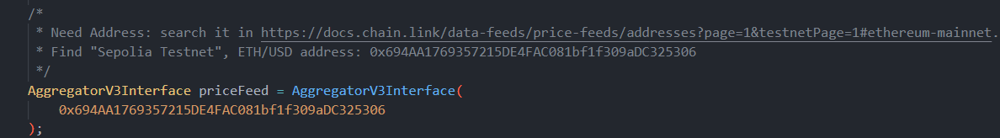
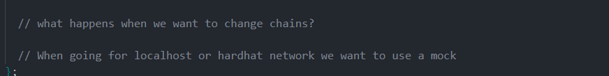
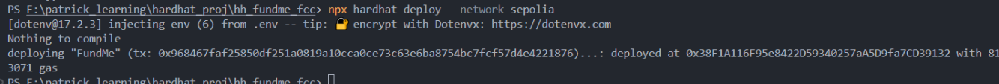

# Multi-Chain Deployment: Mocking and Helper Config

**Author:** Peile Wu  
**Email:** peile.wu.1990@gmail.com  
**Date:** October 25, 2025

---

## Problem: Hardcoded Addresses Don't Work Everywhere

Your contract has a price feed address hardcoded for Sepolia:



**Issues:**

- ❌ Local Hardhat network: address doesn't exist
- ❌ Arbitrum Sepolia: wrong address
- ❌ OP Sepolia: wrong address
- ❌ Manual address changes for each network

Same data (ETH/USD price), different addresses on each chain:



| Network          | Address                                    |
| ---------------- | ------------------------------------------ |
| Sepolia          | 0x694AA1769357215DE4FAC081bf1f309aDC325306 |
| Arbitrum Sepolia | 0xd30e2101a97dcbAeBCBC04F14C3f624E67A35165 |
| OP Sepolia       | 0x61Ec26aA57019C486B10502285c5A3D4A4750AD7 |

---

## Solution: Make Addresses Parameterized

Pass addresses to contracts instead of hardcoding them.

---

## Change 1: FundMe.sol - Accept Price Feed Address

Add state variable to store the price feed:

```solidity
AggregatorV3Interface public priceFeed;
```

Modify constructor to receive the address:

```solidity
constructor(address priceFeedAddress) {
    i_owner = msg.sender;
    priceFeed = AggregatorV3Interface(priceFeedAddress);
}
```

Update `fund()` function to use it:

```solidity
function fund() public payable {
    require(
        msg.value.getConversionRate(priceFeed) >= MINIMUM_USD,
        "Didn't send enough USD ..."
    );
    funders.push(msg.sender);
    addressToAmountFunded[msg.sender] = msg.value;
}
```

**Result:** Constructor now receives the price feed address based on deployment network.

---

## Change 2: PriceConverter.sol - Accept Price Feed as Parameter

Update `getPrice()` to accept price feed instead of hardcoding:

```solidity
function getPrice(
    AggregatorV3Interface priceFeed
) internal view returns (uint256) {
    // Remove hardcoding:
    // AggregatorV3Interface priceFeed = AggregatorV3Interface(
    //     0x694AA1769357215DE4FAC081bf1f309aDC325306
    // );

    (, int256 price, , , ) = priceFeed.latestRoundData();
    return uint256(price * 1e10);
}
```

Update `getConversionRate()` to pass price feed:

```solidity
function getConversionRate(
    uint256 ethAmount,
    AggregatorV3Interface priceFeed
) internal view returns (uint256) {
    uint256 ethPrice = getPrice(priceFeed);
    uint256 ethAmountInUsd = (ethPrice * ethAmount) / 1e18;
    return ethAmountInUsd;
}
```

**Result:** Library functions work with any price feed address passed as parameter.

---

## Change 3: Create helper-hardhat-config.js

New file in project root: `helper-hardhat-config.js`

```javascript
const networkConfig = {
  // Sepolia testnet
  11155111: {
    name: "sepolia",
    ethUsdPriceFeed: "0x694AA1769357215DE4FAC081bf1f309aDC325306",
  },

  // Arbitrum Sepolia
  421614: {
    name: "arbitrumSepolia",
    ethUsdPriceFeed: "0xd30e2101a97dcbAeBCBC04F14C3f624E67A35165",
  },

  // OP Sepolia
  11155420: {
    name: "opSepolia",
    ethUsdPriceFeed: "0x61Ec26aA57019C486B10502285c5A3D4A4750AD7",
  },
};

module.exports = { networkConfig };
```

**How it works:**

- Key = chainId (matches `network.config.chainId`)
- Value = network info including price feed address
- Easy to add new networks later

**Result:** Single source of truth for all network configurations.

---

## Change 4: hardhat.config.js - Add namedAccounts and Networks

Add `namedAccounts` section:

```javascript
namedAccounts: {
  deployer: {
    // First account is deployer on all networks
    default: 0,
  },
},
```

Add environment variables for RPC URLs:

```javascript
const SEPOLIA_RPC_URL = process.env.SEPOLIA_RPC_URL || "";
const ARBITRUM_SEPOLIA_RPC_URL = process.env.ARBITRUM_SEPOLIA_RPC_URL || "";
const OP_SEPOLIA_RPC_URL = process.env.OP_SEPOLIA_RPC_URL || "";
const PRIVATE_KEY = process.env.PRIVATE_KEY || "";
```

Add all networks configuration:

```javascript
networks: {
  sepolia: {
    url: SEPOLIA_RPC_URL,
    accounts: [PRIVATE_KEY],
    chainId: 11155111,
  },
  arbitrumSepolia: {
    url: ARBITRUM_SEPOLIA_RPC_URL,
    accounts: [PRIVATE_KEY],
    chainId: 421614,
  },
  opSepolia: {
    url: OP_SEPOLIA_RPC_URL,
    accounts: [PRIVATE_KEY],
    chainId: 11155420,
  },
  localhost: {
    url: "http://127.0.0.1:8545/",
    chainId: 31337,
  },
},
```


**Result:** All networks configured. Deploy script can switch networks via `--network` flag.

---

## Change 5: 01-deploy-fund-me.js - Dynamic Address Lookup

Import helper config at top:

```javascript
const { networkConfig } = require("../helper-hardhat-config");
```

Update deploy function:

```javascript
module.exports = async ({ getNamedAccounts, deployments }) => {
  const { deploy, log } = deployments;
  const { deployer } = await getNamedAccounts();

  // Get current network's chainId
  const chainId = network.config.chainId;

  // Look up price feed address for this chainId
  const ethUsdPriceFeedAddress = networkConfig[chainId]["ethUsdPriceFeed"];

  // Deploy contract with the address
  const fundMe = await deploy("FundMe", {
    from: deployer,
    args: [ethUsdPriceFeedAddress],
    log: true,
  });

  log(`FundMe deployed to: ${fundMe.address}`);
};

module.exports.tags = ["all", "fundme"];
```

**How it works:**

1. Script runs on a specific network (e.g., `--network sepolia`)
2. Gets that network's chainId (11155111 for Sepolia)
3. Looks up the address in networkConfig using chainId as key
4. Gets the correct price feed address for that network
5. Deploys contract with that address

**Result:** Same script works for all networks automatically.


---

## The Complete Workflow

```
npx hardhat deploy --network sepolia
         ↓
Get chainId = 11155111
         ↓
networkConfig[11155111]["ethUsdPriceFeed"]
         ↓
Returns: 0x694AA1769357215DE4FAC081bf1f309aDC325306
         ↓
Deploy FundMe with this address
         ↓
✅ Contract deployed to Sepolia with correct price feed
```

Different network = different result, same script:

```
npx hardhat deploy --network arbitrumSepolia
         ↓
Get chainId = 421614
         ↓
networkConfig[421614]["ethUsdPriceFeed"]
         ↓
Returns: 0xd30e2101a97dcbAeBCBC04F14C3f624E67A35165
         ↓
✅ Contract deployed to Arbitrum with correct price feed
```

---

## Deploy to Different Networks

```bash
# Deploy to Sepolia
npx hardhat deploy --network sepolia

# Deploy to Arbitrum Sepolia
npx hardhat deploy --network arbitrumSepolia

# Deploy to OP Sepolia
npx hardhat deploy --network opSepolia

# Deploy to local Hardhat network
npx hardhat deploy --network hardhat
```



---

## Benefits of This Approach

| Aspect              | Before                        | After                       |
| ------------------- | ----------------------------- | --------------------------- |
| **Addresses**       | Hardcoded in contract         | Passed as parameters        |
| **Networks**        | Manual address changes        | Automatic chainId lookup    |
| **Deploy Script**   | Different scripts per network | One script for all networks |
| **Adding Network**  | Edit contract code            | Just add to networkConfig   |
| **Maintainability** | Scattered addresses           | Centralized in one file     |

**Key advantages:**

- ✅ One deploy script for all networks
- ✅ Easy to add new networks
- ✅ No code duplication
- ✅ Professional approach (used by Aave, etc.)
- ✅ Prevents mistakes

---

## File Changes Summary

| File                       | Change                           | Purpose                   |
| -------------------------- | -------------------------------- | ------------------------- |
| `FundMe.sol`               | Add constructor parameter        | Accept price feed address |
| `PriceConverter.sol`       | Functions accept priceFeed param | Remove hardcoding         |
| `helper-hardhat-config.js` | NEW file                         | Centralize network config |
| `hardhat.config.js`        | Add namedAccounts + networks     | Configure all networks    |
| `01-deploy-fund-me.js`     | Add dynamic lookup               | Select address by chainId |

---

## Next Steps

Now you can:

1. Deploy to Sepolia, Arbitrum, or Optimism without code changes
2. Add new networks by updating `helper-hardhat-config.js`
3. Use mocking for local testing (next topic)
4. Scale to production with confidence

This pattern is industry standard for multi-chain development.
