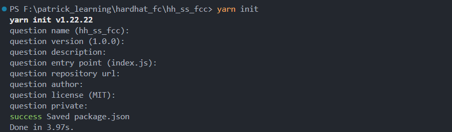
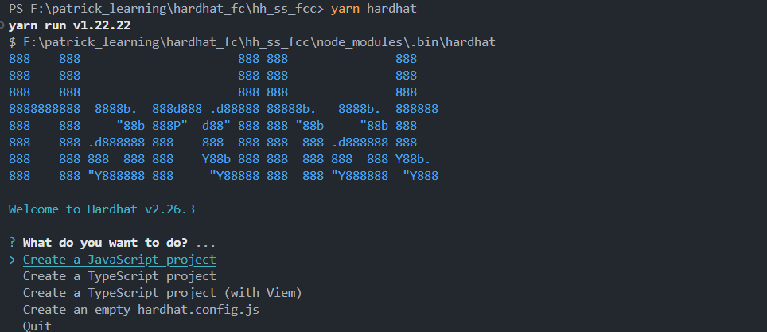
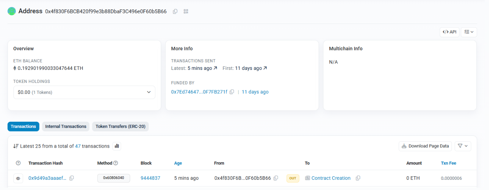
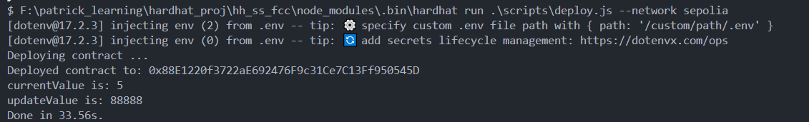

# HH_SS_FCC - Hardhat SimpleStorage Project

**Author:** Peile Wu  
**Email:** peile.wu.1990@gmail.com  
**Date:** October 20, 2025

---

A beginner-friendly Solidity smart contract project built with Hardhat. This project demonstrates how to create, compile, deploy, and verify smart contracts on both local and testnet environments.

## Project Overview

This is an educational project showcasing the complete Hardhat development workflow, including contract compilation, local deployment, testnet integration, and contract code verification on blockchain explorers.

### Key Features

- **SimpleStorage Smart Contract**: A basic Solidity contract demonstrating state variables, mappings, and struct usage
- **Local Development**: Deploy and test contracts on Hardhat's built-in local network
- **Testnet Deployment**: Deploy contracts to Sepolia testnet with environment configuration
- **Contract Verification**: Verify deployed contract code on Etherscan using both CLI and web interface
- **Automated Deployment Scripts**: Ready-to-use deployment scripts for streamlined contract deployment

## Project Structure

```
HH_SS_FCC/
├── artifacts/              # Compiled contract artifacts
├── cache/                  # Hardhat cache directory
├── contracts/
│   └── SimpleStorage.sol   # Main smart contract
├── img/                    # Project screenshots
├── scripts/
│   └── deploy.js           # Contract deployment script
├── test/                   # Test files directory
├── .env                    # Environment variables (not included in repo)
├── .gitignore              # Git ignore rules
├── hardhat.config.js       # Hardhat configuration
├── package.json            # Project dependencies
├── hh_ss_fcc.md            # Main project documentation
└── README.md               # This file
```

## Prerequisites

- **Node.js**: v14 or higher
- **Yarn**: Package manager (or npm)
- **MetaMask or similar**: For testnet interactions (optional)
- **Etherscan Account**: Required for contract verification

## Installation

1. Clone the repository:

```bash
git clone https://github.com/your-username/HH_SS_FCC.git
cd HH_SS_FCC
```

2. Install dependencies:

```bash
yarn install
```

**Setup with Yarn:**



3. Compile contracts:

```bash
yarn hardhat compile
```

**Create Hardhat Project:**



**Edit Contract:**


4. Check Hardhat version:

```bash
npm view hardhat versions --json
```


## Configuration

### Local Development (No Setup Required)

To deploy on Hardhat's local network, simply run:

```bash
yarn hardhat run scripts/deploy.js
```

### Sepolia Testnet Deployment

To deploy on Sepolia testnet, follow these steps:

1. Create a `.env` file in the project root:

```env
SEPOLIA_RPC_URL=https://sepolia.infura.io/v3/YOUR_INFURA_PROJECT_ID
PRIVATE_KEY=your_private_key_here
ETHERSCAN_API_KEY=your_etherscan_api_key_here
```

2. Obtain credentials:

   - **RPC URL**: Get from [Infura](https://infura.io/) or [Alchemy](https://www.alchemy.com/)
   - **Private Key**: Export from MetaMask (use a test wallet only)
   - **Etherscan API Key**: Get from [Etherscan API Dashboard](https://etherscan.io/apis)

3. Configure hardhat.config.js to include Sepolia network settings:


4. Deploy to Sepolia:

```bash
yarn hardhat run scripts/deploy.js --network sepolia
```

⚠️ **Security Warning**: Never commit your `.env` file to version control. The private key should only be used with test wallets containing minimal funds.

## Smart Contract Details

### SimpleStorage.sol

A foundational smart contract demonstrating core Solidity concepts:

**State Variables:**

- `favoriteNumber`: Stores a uint256 value
- `nameTofavoriteNumber`: Mapping from name to favorite number
- `people`: Array of People structs

**Key Functions:**

- `store(uint256)`: Updates the favorite number
- `retrieve()`: Retrieves the current favorite number
- `add()`: Pure function demonstrating basic math
- `addPerson(string, uint256)`: Adds a person to the people array

**Solidity Version:** 0.8.28

## Deployment

### Local Network

```bash
yarn hardhat run scripts/deploy.js
```

### Sepolia Testnet

```bash
yarn hardhat run scripts/deploy.js --network sepolia
```

**Deployment Example:**


**View on Sepolia Etherscan:**



### Contract Interaction on Hardhat

**Retrieve and Update Values:**

```javascript
const { ethers, run, network } = require("hardhat");

async function main() {
  const SimpleStorageFactory = await ethers.getContractFactory("SimpleStorage");
  const simpleStorage = await SimpleStorageFactory.deploy();
  await simpleStorage.waitForDeployment();

  console.log(`Deployed contract to: ${simpleStorage.target}`);

  // Get initial value (default is 5)
  const currentValue = await simpleStorage.retrieve();
  console.log(`currentValue is: ${currentValue}`);

  // Update value
  const transactionResponse = await simpleStorage.store(88888);
  await transactionResponse.wait(1);

  const updateValue = await simpleStorage.retrieve();
  console.log(`updateValue is: ${updateValue}`);
}

main()
  .then(() => process.exit(0))
  .catch((error) => {
    console.error(error);
    process.exit(1);
  });
```

**Hardhat Network Output:**


**Sepolia Testnet Output:**



**Verify on Chain:**


## Contract Verification Guide

### Overview

Contract verification is crucial for transparency and security. It allows users to view and audit your contract source code directly on blockchain explorers like Etherscan.

### Correct hardhat.config.js Configuration

```javascript
require("@nomicfoundation/hardhat-toolbox");
require("dotenv").config();

const SEPOLIA_RPC_URL = process.env.SEPOLIA_RPC_URL;
const PRIVATE_KEY = process.env.PRIVATE_KEY;
const ETHERSCAN_API_KEY = process.env.ETHERSCAN_API_KEY;

/** @type import('hardhat/config').HardhatUserConfig */
module.exports = {
  defaultNetwork: "hardhat",
  networks: {
    sepolia: {
      url: SEPOLIA_RPC_URL,
      accounts: [PRIVATE_KEY],
      chainId: 11155111,
    },
  },
  solidity: "0.8.28",
  etherscan: {
    apiKey: ETHERSCAN_API_KEY,
  },
};
```

**Key Points:**

- `etherscan` configuration must be at the same level as `networks` and `solidity` (not nested inside `networks`)
- `etherscan` only requires `apiKey`, **NOT** `url`
- Use environment variables for all sensitive information

### Common Configuration Errors

#### Error 1: etherscan nested inside networks

```javascript
// ❌ WRONG
networks: {
  sepolia: { ... },
  etherscan: {  // This is incorrect!
    apiKey: { ... }
  }
}
```

**Error Message:**

```
Invalid value undefined for HardhatConfig.networks.etherscan.url - Expected a value of type string.
```

**Fix:** Move `etherscan` outside of `networks`

#### Error 2: Missing etherscan configuration

**Error Message:**

```
HH306: The 'address' parameter of task 'verify:etherscan' expects a value, but none was passed.
```

**Fix:** Add `etherscan` configuration with your API key

#### Error 3: Network connection timeout

**Error Message:**

```
A network request failed. This is an error from the block explorer, not Hardhat. Error: Connect Timeout Error
```

**Cause:** Network connectivity issues (common in mainland China due to Etherscan firewall restrictions)

**Solutions:**

- Use VPN/proxy to access Etherscan
- Use web-based manual verification (recommended for mainland China)
- Retry after some time

### Method 1: CLI Automatic Verification (Recommended for stable networks)

**Basic verification:**

```bash
yarn hardhat verify --network sepolia 0xd9eaaad0ff703d533014dad93f85db804243f2f3
```

**Verification with constructor arguments:**

```bash
yarn hardhat verify --network sepolia 0xd9eaaad0ff703d533014dad93f85db804243f2f3 "arg1" "arg2"
```

**With detailed output:**

```bash
yarn hardhat verify --network sepolia 0xd9eaaad0ff703d533014dad93f85db804243f2f3 --verbose
```

### Method 2: Web-Based Manual Verification (Recommended for mainland China)

**Steps:**

1. Visit https://sepolia.etherscan.io
2. Search for your contract address: `0xd9eaaad0ff703d533014dad93f85db804243f2f3`
3. Navigate to the contract page
4. Click the **"Contract"** tab
5. Click **"Verify and Publish"** button
6. Select **Single File** or **Multi File** (usually Single File)
7. Choose Solidity Version: `0.8.28`
8. Set optimization settings to match your compilation
9. Copy your contract source code from `contracts/SimpleStorage.sol`
10. Paste into the code field
11. Complete CAPTCHA
12. Click **"Verify and Publish"**

**Advantages:**

- Works reliably even with poor Etherscan connectivity
- No CLI dependency
- Immediate visual feedback
- Easier to debug

### Obtaining Etherscan API Key

**Important:** Etherscan API keys are **network-agnostic**. An API key created on mainnet can be used for all testnets (Sepolia, Goerli, etc.)

**Steps:**

1. Visit https://etherscan.io/apis
2. Log in to your Etherscan account (or create one)
3. Click **"Create API Key"**
4. Name it (e.g., "HH_SS_FCC")
5. Copy the API key
6. Add it to your `.env` file:

```env
ETHERSCAN_API_KEY=your_api_key_here
```

### Verification Configuration Best Practices

**Environment Variables (.env):**

```env
# Network Configuration
SEPOLIA_RPC_URL=https://sepolia.infura.io/v3/YOUR_INFURA_PROJECT_ID
PRIVATE_KEY=your_private_key_here

# Verification Configuration
ETHERSCAN_API_KEY=your_etherscan_api_key_here
```

**Git Security:**

```
# .gitignore
.env
.env.local
```

### Verification Status Check

After verification, you can:

1. View your contract on Sepolia Etherscan
2. Click the **"Contract"** tab to see the verified source code
3. Users can now read and audit your contract directly on Etherscan

## Available Scripts

```bash
# Compile contracts
yarn hardhat compile

# Deploy to local network
yarn hardhat run scripts/deploy.js

# Deploy to Sepolia testnet
yarn hardhat run scripts/deploy.js --network sepolia

# Verify contract on Sepolia
yarn hardhat verify --network sepolia <contract_address>

# Run tests
yarn hardhat test

# Start local network node
yarn hardhat node

# Get help
yarn hardhat help
```

## Technologies Used

- **Hardhat**: Ethereum development environment (v2.26.3)
- **Solidity**: Smart contract language (v0.8.28)
- **Ethers.js**: Ethereum library integration (v6.4.0)
- **dotenv**: Environment variable management (v17.2.3)
- **@nomicfoundation/hardhat-toolbox**: Hardhat toolbox integration

## Dependencies

```json
{
  "devDependencies": {
    "@nomicfoundation/hardhat-toolbox": "^6.0.0",
    "@nomicfoundation/hardhat-verify": "^2.0.0",
    "@nomiclabs/hardhat-etherscan": "^3.1.8",
    "hardhat": "2.26.3",
    "ethers": "^6.4.0",
    "dotenv": "^17.2.3"
  }
}
```

## Chain IDs Reference

| Network         | Chain ID | RPC Endpoint                              |
| --------------- | -------- | ----------------------------------------- |
| Sepolia Testnet | 11155111 | https://sepolia.infura.io/v3/{PROJECT_ID} |
| Hardhat Local   | 31337    | http://localhost:8545                     |
| Mainnet         | 1        | https://mainnet.infura.io/v3/{PROJECT_ID} |

## Useful Resources

- [Hardhat Documentation](https://hardhat.org/docs)
- [Hardhat Verify Plugin](https://hardhat.org/hardhat-runner/plugins/nomicfoundation-hardhat-verify)
- [Solidity Documentation](https://docs.soliditylang.org/)
- [Sepolia Etherscan](https://sepolia.etherscan.io/)
- [Etherscan API Documentation](https://docs.etherscan.io/)
- [Chainlist](https://chainlist.org/) - RPC endpoints and chain IDs
- [Infura](https://infura.io/) - RPC provider
- [Alchemy](https://www.alchemy.com/) - RPC provider

## Troubleshooting

| Issue                     | Solution                                  |
| ------------------------- | ----------------------------------------- |
| "Connect Timeout Error"   | Use VPN or manual web verification        |
| "Invalid value undefined" | Check etherscan is not nested in networks |
| "API key not found"       | Add ETHERSCAN_API_KEY to .env file        |
| "Already verified"        | Contract is already verified on Etherscan |
| "Address not found"       | Verify the contract address is correct    |

## Learning Journey

This project takes you through:

1. ✅ Setting up Hardhat environment
2. ✅ Writing simple Solidity contracts
3. ✅ Compiling contracts
4. ✅ Deploying to local Hardhat network
5. ✅ Deploying to Sepolia testnet
6. ✅ Interacting with contracts via ethers.js
7. ✅ Verifying contracts on Etherscan
8. ✅ Viewing verified contracts on blockchain explorers

## Next Steps

- [ ] Deploy your own version to Sepolia testnet
- [ ] Verify your contract using CLI method
- [ ] Verify your contract using web method
- [ ] View verified contract on Sepolia Etherscan
- [ ] Extend SimpleStorage with additional functionality
- [ ] Deploy to other testnets (Goerli, Mumbai, etc.)
- [ ] Explore hardhat testing framework

## License

MIT

---

This project is for educational purposes. Always use test wallets and testnet funds when learning and experimenting with smart contracts. **Never expose your private keys or commit sensitive information to version control.**

---

**Last Updated:** October 20, 2025  
**Tested with:** Hardhat v2.26.3, Node.js v14+, Solidity v0.8.28
