# HH_SS_FCC - Hardhat SimpleStorage Project

**Author:** Peile Wu  
**Email:** peile.wu.1990@gmail.com  
**Date:** October 21, 2025

---

A beginner-friendly Solidity smart contract project built with Hardhat. This project demonstrates how to create, compile, deploy, and verify smart contracts on both local and testnet environments, as well as creating custom Hardhat tasks.

---

## Table of Contents

- [Part 1: Basic Setup and Deployment](#part-1-basic-setup-and-deployment)
- [Part 2: Custom Hardhat Tasks](#part-2-custom-hardhat-tasks)
- [Part 3: Local Development and Console](#part-3-local-development-and-console)

---

# Part 1: Basic Setup and Deployment

## Project Overview

This is an educational project showcasing the complete Hardhat development workflow, including contract compilation, local deployment, testnet integration, and contract code verification on blockchain explorers.

### Key Features

- **SimpleStorage Smart Contract**: A basic Solidity contract demonstrating state variables, mappings, and struct usage
- **Local Development**: Deploy and test contracts on Hardhat's built-in local network
- **Testnet Deployment**: Deploy contracts to Sepolia testnet with environment configuration
- **Contract Verification**: Verify deployed contract code on Etherscan using both CLI and web interface
- **Automated Deployment Scripts**: Ready-to-use deployment scripts for streamlined contract deployment

## Project Structure

```
HH_SS_FCC/
├── artifacts/              # Compiled contract artifacts
├── cache/                  # Hardhat cache directory
├── contracts/
│   └── SimpleStorage.sol   # Main smart contract
├── scripts/
│   └── deploy.js           # Contract deployment script
├── tasks/
│   └── block-number.js     # Custom Hardhat task
├── test/                   # Test files directory
├── img/                    # Screenshots directory
│   ├── custom_hardhat_tasks/
│   ├── hardhat_localnode/
│   └── hardhat_run/
├── .env                    # Environment variables (not included in repo)
├── .gitignore              # Git ignore rules
├── hardhat.config.js       # Hardhat configuration
├── package.json            # Project dependencies
├── hh_ss_fcc.md            # Main project documentation
└── README.md               # This file
```

## Prerequisites

- **Node.js**: v14 or higher
- **Yarn**: Package manager (or npm)
- **MetaMask or similar**: For testnet interactions (optional)
- **Etherscan Account**: Required for contract verification

## Installation

1. Clone the repository:

```bash
git clone https://github.com/your-username/HH_SS_FCC.git
cd HH_SS_FCC
```

2. Install dependencies:

```bash
yarn install
```


3. Compile contracts:

```bash
yarn hardhat compile
```


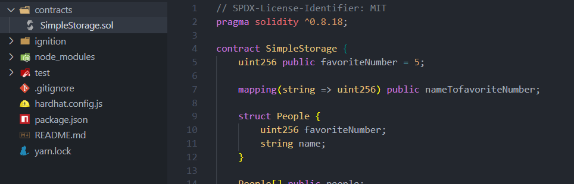

4. Check Hardhat version:

```bash
npm view hardhat versions --json
```

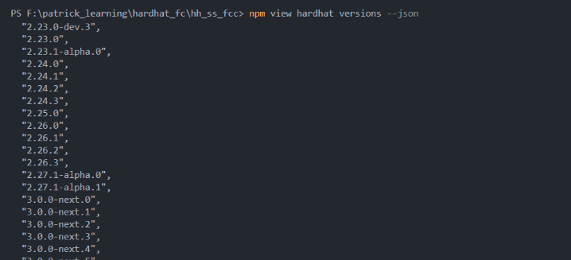

## Configuration

### Local Development (No Setup Required)

To deploy on Hardhat's local network, simply run:

```bash
yarn hardhat run scripts/deploy.js
```

### Sepolia Testnet Deployment

1. Create a `.env` file in the project root:

```env
SEPOLIA_RPC_URL=https://sepolia.infura.io/v3/YOUR_INFURA_PROJECT_ID
PRIVATE_KEY=your_private_key_here
ETHERSCAN_API_KEY=your_etherscan_api_key_here
```

2. Obtain credentials:

   - **RPC URL**: Get from [Infura](https://infura.io/) or [Alchemy](https://www.alchemy.com/)
   - **Private Key**: Export from MetaMask (use a test wallet only)
   - **Etherscan API Key**: Get from [Etherscan API Dashboard](https://etherscan.io/apis)

3. Configure hardhat.config.js to include Sepolia network settings:

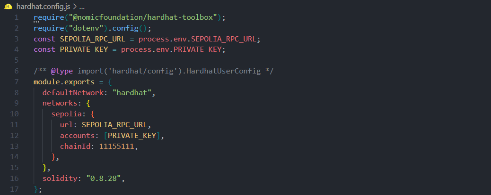

4. Deploy to Sepolia:

```bash
yarn hardhat run scripts/deploy.js --network sepolia
```

⚠️ **Security Warning**: Never commit your `.env` file to version control. The private key should only be used with test wallets containing minimal funds.

## Deployment

### Local Network

```bash
yarn hardhat run scripts/deploy.js
```

### Sepolia Testnet

```bash
yarn hardhat run scripts/deploy.js --network sepolia
```

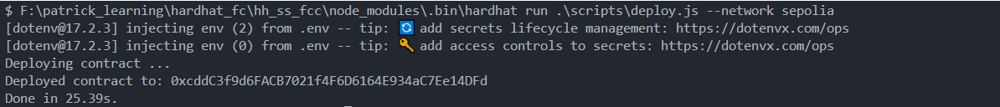


### Contract Interaction

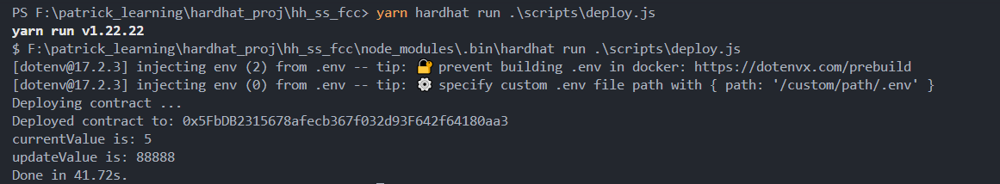


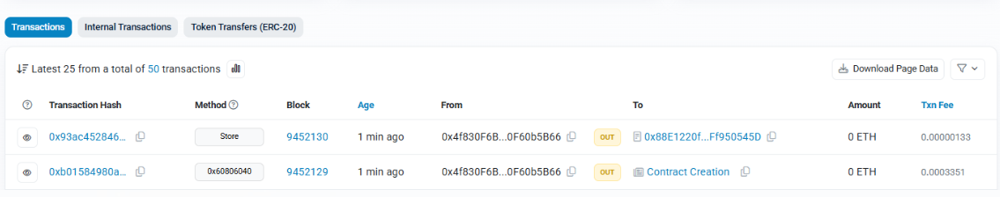

## Contract Verification

### Configuration

**Key Points:**

- `etherscan` configuration must be at the same level as `networks` and `solidity`
- `etherscan` only requires `apiKey`, **NOT** `url`
- Use environment variables for all sensitive information

### CLI Verification

```bash
yarn hardhat verify --network sepolia <contract_address>
```

### Web-Based Verification (Recommended for mainland China)

1. Visit https://sepolia.etherscan.io
2. Search for your contract address
3. Click the **"Contract"** tab → **"Verify and Publish"**
4. Select **Single File**, choose Solidity Version: `0.8.28`
5. Copy your contract source code and paste
6. Complete CAPTCHA and click **"Verify and Publish"**

### Obtaining Etherscan API Key

**Important:** Etherscan API keys are **network-agnostic**. An API key created on mainnet can be used for all testnets.

1. Visit https://etherscan.io/apis
2. Log in to your Etherscan account
3. Click **"Create API Key"**
4. Copy the API key and add to `.env`:

```env
ETHERSCAN_API_KEY=your_etherscan_api_key_here
```

## Available Scripts

```bash
# Compile contracts
yarn hardhat compile

# Deploy to local network
yarn hardhat run scripts/deploy.js

# Deploy to Sepolia testnet
yarn hardhat run scripts/deploy.js --network sepolia

# Verify contract on Sepolia
yarn hardhat verify --network sepolia <contract_address>

# Run tests
yarn hardhat test

# Start local network node
yarn hardhat node

# Get help
yarn hardhat help
```

## Technologies Used

- **Hardhat**: Ethereum development environment (v2.26.3)
- **Solidity**: Smart contract language (v0.8.28)
- **Ethers.js**: Ethereum library integration (v6.4.0)
- **dotenv**: Environment variable management (v17.2.3)
- **@nomicfoundation/hardhat-toolbox**: Hardhat toolbox integration

## Chain IDs Reference

| Network         | Chain ID | RPC Endpoint                              |
| --------------- | -------- | ----------------------------------------- |
| Sepolia Testnet | 11155111 | https://sepolia.infura.io/v3/{PROJECT_ID} |
| Hardhat Local   | 31337    | http://localhost:8545                     |
| Mainnet         | 1        | https://mainnet.infura.io/v3/{PROJECT_ID} |

---

# Part 2: Custom Hardhat Tasks

## Overview

Hardhat allows you to extend its functionality by creating custom tasks. Custom tasks are reusable scripts that can be executed directly from the command line.

## View Built-in Tasks

```bash
yarn hardhat
```

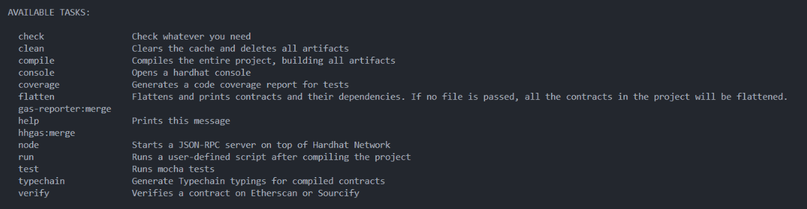

## Creating a Custom Task

### Step 1: Create Task File

Create `tasks/block-number.js`:

```javascript
const { task } = require("hardhat/config");

task("block-number", "Prints the current block number").setAction(
  async (taskArgs, hre) => {
    const blockNumber = await hre.ethers.provider.getBlockNumber();
    console.log(`Current block number is: ${blockNumber}`);
  }
);
```

**Key Concepts:**

- **task()**: Defines a new Hardhat task
- **setAction()**: Specifies the execution function
- **hre**: Hardhat Runtime Environment, provides access to ethers and network utilities

### Step 2: Import in hardhat.config.js

Add at the top of `hardhat.config.js`:

```javascript
require("./tasks/block-number");
```

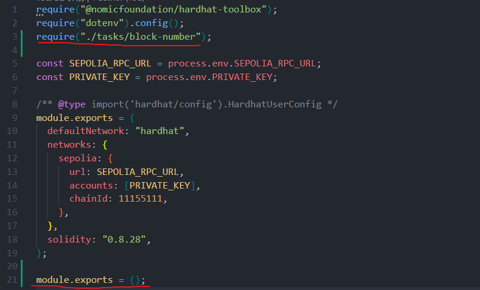

### Step 3: Verify Task Added

```bash
yarn hardhat
```

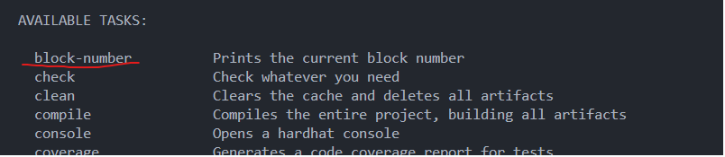

### Step 4: Run the Task

```bash
yarn hardhat block-number
```

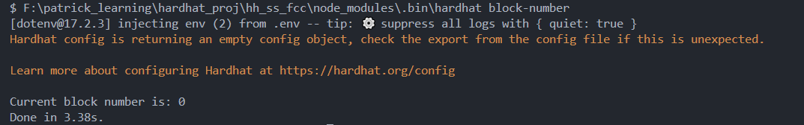

## Running on Different Networks

```bash
# Local network
yarn hardhat block-number

# Sepolia testnet
yarn hardhat block-number --network sepolia
```

## Advanced Features

### Adding Parameters

```javascript
task("block-number", "Prints the current block number")
  .addParam("display", "Display format")
  .setAction(async (taskArgs, hre) => {
    const blockNumber = await hre.ethers.provider.getBlockNumber();

    if (taskArgs.display === "json") {
      console.log(JSON.stringify({ blockNumber }));
    } else {
      console.log(`Current block number is: ${blockNumber}`);
    }
  });
```

**Usage:**

```bash
yarn hardhat block-number --display json
```

## Benefits

- **Reusability**: Write once, use anywhere
- **Automation**: Automate repetitive workflows
- **Efficiency**: Save time with CLI shortcuts

## Common Use Cases

- Checking blockchain state (block number, gas price, etc.)
- Querying contract data
- Managing accounts and balances
- Automating deployment steps

---

# Part 3: Local Development and Console

## Local Node Development

### Quick Start

Terminal 1 - Start the local node:

```bash
yarn hardhat node
```

Terminal 2 - Deploy to localhost:

```bash
yarn hardhat run .\scripts\deploy.js --network localhost
```

### Configuration

Add to `hardhat.config.js`:

```javascript
localhost: {
  url: "http://127.0.0.1:8545/",
  chainId: 31337,
}
```

All transaction logs display in the node terminal.


---

## Hardhat Console

Interactive JavaScript environment with pre-loaded ethers.js utilities. No script files needed.

### Console with localhost

Terminal 1 - Start node:

```bash
yarn hardhat node
```

Terminal 2 - Enter console:

```bash
yarn hardhat console --network localhost
```

Deploy and interact directly:

```javascript
> const SimpleStorageFactory = await ethers.getContractFactory("SimpleStorage")
> const simpleStorage = await SimpleStorageFactory.deploy()
> await simpleStorage.retrieve()
5n
> await simpleStorage.store(666)
> await simpleStorage.retrieve()
666n
```

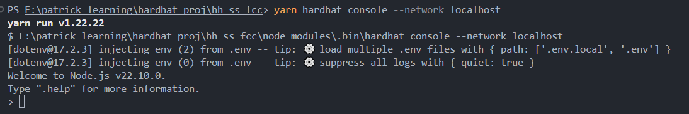

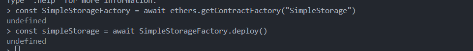

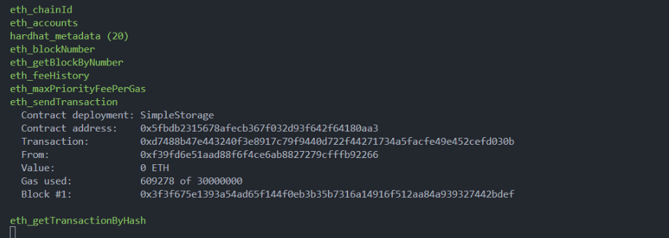

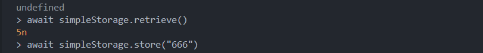

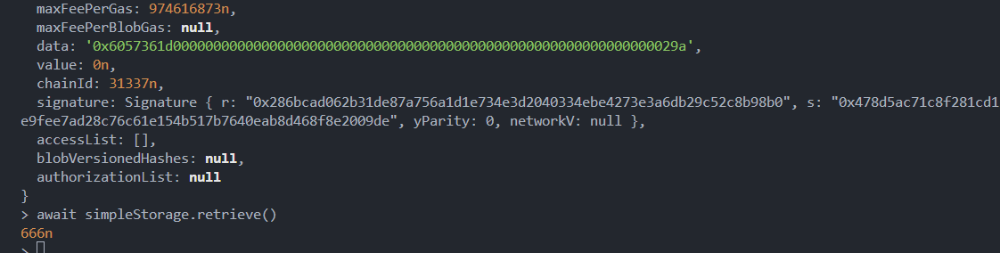

### Console with Hardhat Network

Start ephemeral network (cleared on exit):

```bash
yarn hardhat console --network hardhat
```

Exit: `Ctrl + C` × 2

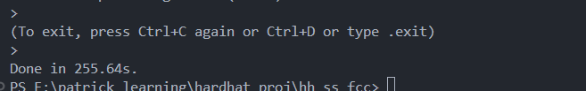

### Console with Sepolia Testnet

Query live testnet:

```bash
yarn hardhat console --network sepolia

> await ethers.provider.getBlockNumber()
```

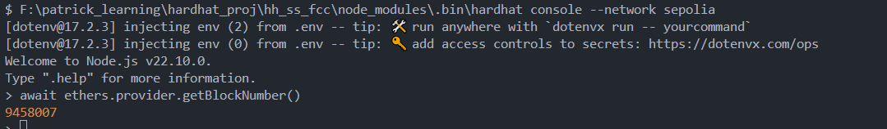

---

**Last Updated:** October 21, 2025  
**Tested with:** Hardhat v2.26.3, Node.js v14+, Solidity v0.8.28
