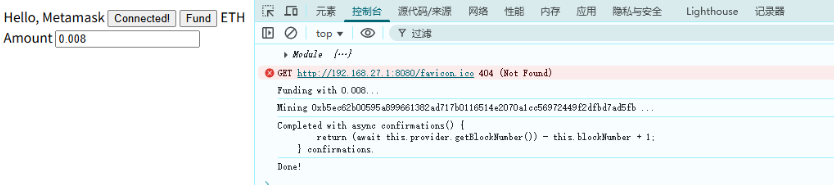
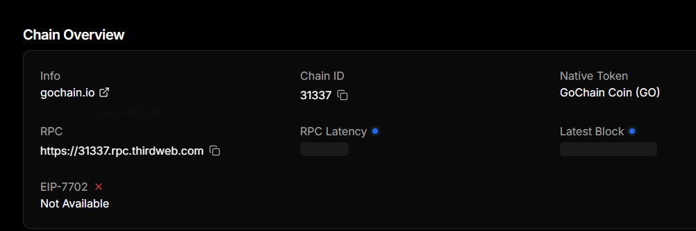
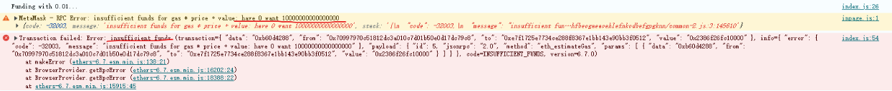
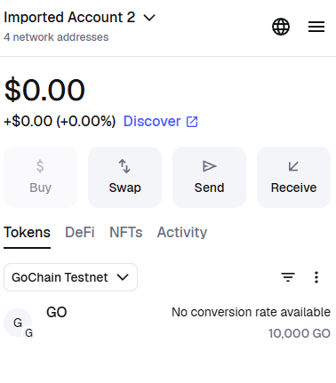
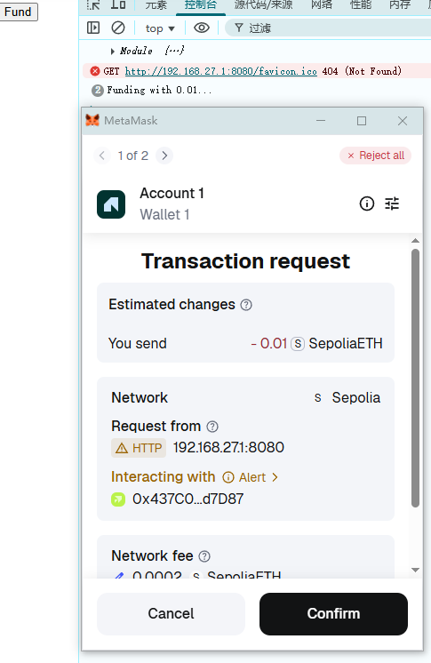
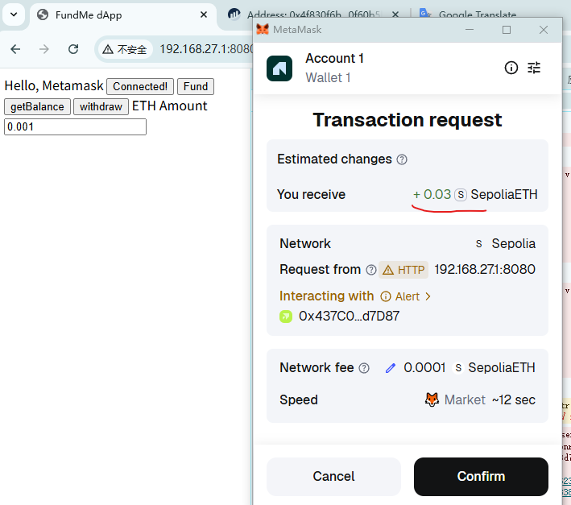

# FundMe dApp - Frontend Setup Guide

**Author:** Peile Wu  
**Contact:** peile.wu.1990@gmail.com  
**Date:** October 31, 2025

## Overview

This guide walks through the process of building a decentralized application (dApp) frontend that connects to the Ethereum blockchain via MetaMask. This project demonstrates the full-stack approach: Smart Contracts (backend) + HTML/JavaScript (frontend).

## Project Structure

```
html_fundme_fcc/
├── index.html
├── index.js
├── ethers-6.7.esm.min.js
├── constants.js
├── package.json
└── frontEnd_fundMe.md
```

## Setup Instructions

### 1. Create HTML Structure

In VSCode, create an `index.html` file. You can use the built-in snippet by typing `!` and pressing Enter to generate the basic HTML framework:

```html
<!DOCTYPE html>
<html lang="en">
    <head>
        <meta charset="UTF-8" />
        <meta name="viewport" content="width=device-width, initial-scale=1.0" />
        <title>FundMe dApp</title>
    </head>
    <body>
        Hello, Metamask
        <script src="./index.js" type="module"></script>
        <button id="connectButton">Connect Wallet</button>
        <button id="fundButton">Fund</button>
        <button id="balanceButton">getBalance</button>
        <button id="withdrawButton">withdraw</button>
        <!-- form -->
        <label for="fund">ETH Amount</label>
        <input id="ethAmount" placeholder="> 0.006" />
    </body>
</html>
```

**Important:** Set the script type to `module` to enable ES6 imports:

```html
<script src="./index.js" type="module"></script>
```

**New Features Added:**

-   Balance button to query contract balance
-   Withdraw button to withdraw funds
-   Input field for user-specified ETH amount




### 2. Install Live Server Extension

Install the Live Server extension in VSCode to preview your website in real-time:


Click the "Go Live" button at the bottom of VSCode to start the server:


### 3. Set Up HTTP Server with npm

Install the http-server package to run your application:

```bash
npm install --save-dev http-server --legacy-peer-deps
```

Then stop Live Server and run:

```bash
npx http-server -c-1 --cors
```

This will display available URLs:


### 4. Add JavaScript Functionality

Create an `index.js` file with the connect function and button event listeners:

```javascript
//import { ethers } from "./ethers-6.7.esm.min.js";
//import { ethers } from "https://cdnjs.cloudflare.com/ajax/libs/ethers.js/6.7.0/ethers.esm.min.js";
import * as ethers from "./ethers-6.7.esm.min.js";
import { abi, contractAddress } from "./constants.js";

const connectButton = document.getElementById("connectButton");
const fundButton = document.getElementById("fundButton");
const balanceButton = document.getElementById("balanceButton");
const withdrawButton = document.getElementById("withdrawButton");
connectButton.onclick = connect;
fundButton.onclick = fund;
balanceButton.onclick = getBalance;
withdrawButton.onclick = withdraw;

console.log(ethers);

async function connect() {
    if (typeof window.ethereum !== "undefined") {
        await window.ethereum.request({
            method: "eth_requestAccounts",
        });
        connectButton.innerHTML = "Connected!";
    } else {
        connectButton.innerHTML = "Please Install Metamask.";
    }
}

async function getBalance() {
    if (typeof window.ethereum != "undefined") {
        const provider = new ethers.BrowserProvider(window.ethereum);
        const balance = await provider.getBalance(contractAddress);
        console.log(ethers.formatEther(balance));
    }
}

async function fund(ethAmount) {
    ethAmount = document.getElementById("ethAmount").value;
    console.log(`Funding with ${ethAmount}...`);
    if (typeof window.ethereum !== "undefined") {
        /*
         * What we need to send a transaction:
         * provider: connection to the blockchain
         * signer: someone's wallet with some gas
         * contract that we are interacting with: need ABI & address
         */
        // BrowserProvider(ether-v6) receives the HTTP endpoint and imports it into ethers.
        // Here, we find the HTTP endpoint from Metamask and use it as the provider.
        const provider = new ethers.BrowserProvider(window.ethereum);
        // Since the provider is connected to Metamask, the signer can be obtained directly.
        // To be precise, it refers to the account on Metamask. If it's account1, then account1 is the signer.
        const signer = await provider.getSigner();
        //console.log(signer);
        // Create a contract object
        const contract = new ethers.Contract(contractAddress, abi, signer);

        // Create transaction
        try {
            const transactionResponse = await contract.fund({
                value: ethers.parseEther(ethAmount),
            });
            // listen for the tx to be mined
            await listenForTransactionMine(transactionResponse, provider);
            console.log("Done!");
        } catch (error) {
            console.error("Transaction failed:", error);
        }
    }
}

function listenForTransactionMine(transactionResponse, provider) {
    console.log(`Mining ${transactionResponse.hash} ...`);
    /*
     * Listen for this transaction to finish.
     * Use provider.once to trigger event only once.
     * Once "provider.once" sees a transaction hash, it will pass a 'transactionReceipt' parameter to the listener function.
     * Once 'transactionResponse' completes, 'transactionReceipt' is obtained.
     */

    // Use Promise, it will execute when the listener finishes listening.
    // Once the listener has finished listening, it runs "resolve" and this Promise is only resolved when the `transactionResponse` is triggered.
    // if a timeout of a certain type occurs, it chooses to reject the request using "reject".
    return new Promise((resolve, reject) => {
        provider.once(transactionResponse.hash, (transactionReceipt) => {
            console.log(
                `Completed with ${transactionReceipt.confirmations} confirmations.`
            );
            resolve();
        });
    });
}

// withdraw
async function withdraw() {
    if (typeof window.ethereum != "undefined") {
        console.log("Withdrawing ...");
        const provider = new ethers.BrowserProvider(window.ethereum);
        const signer = await provider.getSigner();
        const contract = new ethers.Contract(contractAddress, abi, signer);
        try {
            const transactionResponse = await contract.withdraw();
            await listenForTransactionMine(transactionResponse, provider);
        } catch (error) {
            console.log(error);
        }
    }
}
```

### 5. Check MetaMask Installation

To verify MetaMask is installed, check for the `window.ethereum` object:

```javascript
if (typeof window.ethereum !== "undefined") {
    console.log("I see a Metamask!");
} else {
    console.log("No Metamask.");
}
```

**With MetaMask installed:**


**Without MetaMask:**


## Importing Ethers.js Library

### Using CDN Import (Recommended)

In `index.js`, import ethers from the CDN:

```javascript
import { ethers } from "https://cdnjs.cloudflare.com/ajax/libs/ethers.js/6.7.1/ethers.umd.min.js";
```

This approach avoids the need to manage node_modules and provides a direct browser-compatible version of ethers.


### Verifying Ethers Import

You can verify the ethers library is loaded by logging it to the console:

```javascript
console.log(ethers);
```

Refresh the page and check the console to see all available ethers APIs:


## Common Pitfalls & Solutions

### ⚠️ Pitfall 1: Red Flag Error (CSP Violation)

If you see a red flag error when trying to connect:


**Solution:** Try using a different IP address from the available options. For example, use `192.168.50.180:8080` instead of `127.0.0.1:8080`:


Once connected, the MetaMask popup will appear:


### ⚠️ Pitfall 2: Browser Cache Issues

If your code changes don't appear after refreshing, the browser may have cached the old version.

**Solution:** Hard refresh to clear the cache:

-   Right-click the refresh button
-   Select "Empty cache and hard refresh"

### ⚠️ Pitfall 3: MetaMask Not Popping Up

**Issue:** The connect function might trigger MetaMask popup on every page load, which can be annoying.

**Solution:** Wrap the connection logic in an async function and attach it to a button click only by using event listener assignment:

```javascript
const connectButton = document.getElementById("connectButton");
connectButton.onclick = connect;
```

This ensures the connection only triggers when the button is clicked, not on page load.

### ⚠️ Pitfall 4: HTTP Server Started in Wrong Directory

**Issue:** After restarting http-server, you experience various errors on the webpage.

**Solution:** Ensure you run the http-server command from the project's root directory:

```bash
npx http-server -c-1 --cors
```


After confirming the correct directory, reload the webpage as needed:


### ⚠️ Pitfall 5: Button Not Responding to Clicks

**Issue:** Buttons don't trigger functions after restructuring code.

**Solution:** When moving functions from inline onclick handlers to event listeners, ensure buttons have proper IDs and the event listeners are set up correctly:

```html
<button id="connectButton">Connect Wallet</button>
<button id="fundButton">Fund</button>
<button id="balanceButton">getBalance</button>
<button id="withdrawButton">withdraw</button>
```

```javascript
const connectButton = document.getElementById("connectButton");
const fundButton = document.getElementById("fundButton");
const balanceButton = document.getElementById("balanceButton");
const withdrawButton = document.getElementById("withdrawButton");

connectButton.onclick = connect;
fundButton.onclick = fund;
balanceButton.onclick = getBalance;
withdrawButton.onclick = withdraw;
```


### ⚠️ Pitfall 6: Chain ID 31337 Conflict with GoChain

**Issue:** MetaMask hardcodes Chain ID 31337 to GoChain Testnet, which uses GO tokens instead of ETH for gas. This prevents transactions from being sent even with imported Hardhat accounts.



**Error Message:** `insufficient funds for gas * price * value`



**Root Cause:**

-   Hardhat's default Chain ID is 31337
-   GoChain network also uses Chain ID 31337
-   MetaMask hardcoded this mapping, forcing the network to be identified as GoChain
-   Even though Hardhat accounts have 10,000 ETH, they display as GO tokens in MetaMask



**Solution:** Use Sepolia testnet instead of local Hardhat:

1. Deploy your contract to Sepolia
2. Update `constants.js` with the Sepolia contract address:

```javascript
export const contractAddress = "0x39D556fA7fD8741F318c89F1FfaAdD7BcEf8290A";
```


3. Switch MetaMask to Sepolia network
4. Refresh the page and test your dApp



## Features Implemented

✅ MetaMask detection  
✅ Wallet connection functionality  
✅ Button-triggered connection (no auto-popup on page load)  
✅ Real-time button state update  
✅ Error handling  
✅ Ethers.js library integration  
✅ Fund function with transaction confirmation  
✅ Balance query functionality  
✅ Withdraw functionality  
✅ User-input ETH amount selection  
✅ Transaction mining listener  
✅ Sepolia testnet support

## Running the Application

1. Ensure you're in the project root directory

2. Start the HTTP server:

    ```bash
    npx http-server -c-1 --cors
    ```

3. Open your browser and navigate to one of the provided URLs (e.g., `http://192.168.50.180:8080`)

4. Ensure MetaMask is set to Sepolia network

5. Click the "Connect Wallet" button

6. Approve the connection in the MetaMask popup

7. Enter an ETH amount (e.g., 0.006)

8. Click "Fund" to send a transaction

9. Confirm the transaction in MetaMask

10. Monitor the console for transaction confirmation



## Next Steps

-   Add real-time balance display on the UI
-   Build a transaction history interface
-   Add input validation for ETH amounts
-   Upgrade to React framework for improved UI
-   Deploy to mainnet
-   Add additional features (staking, governance, etc.)

---

# Part 2: Sending Transactions on the Web

## BrowserProvider vs JsonRpcProvider

There are two main provider classes in ethers.js to connect with the blockchain. Here are their differences:

### BrowserProvider (ethers-v6)

Used to connect with **browser wallet plugins like MetaMask**

-   Retrieves connection through the `window.ethereum` object
-   Users can **sign transactions directly** (wallet will pop up for confirmation)
-   Ideal for frontend dApp development
-   **Only available in the browser environment**

```javascript
const provider = new ethers.BrowserProvider(window.ethereum);
const signer = await provider.getSigner();
```

**Key Point:** This is an asynchronous operation. You must use `await` to ensure you get a valid signer object.

### JsonRpcProvider

Used to connect with **public RPC nodes** (such as Alchemy, Infura, etc.)

-   Requires providing an RPC URL, for example: `https://eth-mainnet.g.alchemy.com/v2/your-key`
-   **Can only read data**, cannot sign transactions
-   Suitable for backend services or scenarios where you only need to query data

```javascript
const provider = new ethers.JsonRpcProvider(
    "https://eth-mainnet.g.alchemy.com/v2/key"
);
// Only able to read data
const balance = await provider.getBalance(address);
```

## Implementing the Fund Function - Sending Transactions

Now we need to implement the complete `fund()` function to send actual transactions. Here are the complete steps:

### Step 1: Import Required Constants

First, create a new file `constants.js` to store the contract's ABI and deployed address:

```javascript
// constants.js
export const abi = [
    // Copy the complete ABI from artifacts/contracts/FundMe.sol/FundMe.json
    // ... ABI content ...
];

export const contractAddress = "0x39D556fA7fD8741F318c89F1FfaAdD7BcEf8290A";
```

#### How to Get the ABI?

The ABI is stored in the compiled artifacts from Hardhat. Find it at: `hh_fundme_fcc/artifacts/contracts/FundMe.sol/FundMe.json`

Open that file, find the `"abi"` field, and copy its complete content into `constants.js`:


#### How to Get the Contract Address?

When you deploy your contract to Sepolia testnet, record the deployment address from the output logs:

```bash
npx hardhat deploy --network sepolia
```

The contract address will be displayed in the console. Add it to `constants.js`:


In `index.js`, import these constants:

```javascript
import * as ethers from "./ethers-6.7.esm.min.js";
import { abi, contractAddress } from "./constants.js";
```

### Step 2: Implement the Fund Function with User Input

Here is the complete `fund()` function implementation with user-specified ETH amount:

```javascript
async function fund(ethAmount) {
    ethAmount = document.getElementById("ethAmount").value;
    console.log(`Funding with ${ethAmount}...`);

    if (typeof window.ethereum !== "undefined") {
        /*
         * To send a transaction, you need three key components:
         * 1. provider: Connection to the blockchain
         * 2. signer: Wallet account with sufficient gas
         * 3. contract: Contract reference with ABI and address
         */

        // BrowserProvider connects to MetaMask's HTTP endpoint
        const provider = new ethers.BrowserProvider(window.ethereum);

        // Get the signer from MetaMask (must use await for async operation)
        const signer = await provider.getSigner();

        // Create a contract object to call contract functions
        const contract = new ethers.Contract(contractAddress, abi, signer);

        // Create and send the transaction
        try {
            const transactionResponse = await contract.fund({
                value: ethers.parseEther(ethAmount),
            });
            // listen for the tx to be mined
            await listenForTransactionMine(transactionResponse, provider);
            console.log("Done!");
        } catch (error) {
            console.error("Transaction failed:", error);
        }
    }
}
```

**Key Points:**

-   Use `await provider.getSigner()` to ensure you get a valid signer
-   `ethers.parseEther()` converts human-readable ETH amounts to wei
-   `contract.fund()` calls the fund function on the smart contract
-   Use try-catch to handle potential errors
-   User can now specify the ETH amount via input field

### Step 3: Implement Transaction Mining Listener

The `listenForTransactionMine()` function listens for the transaction to be confirmed on the blockchain:

```javascript
function listenForTransactionMine(transactionResponse, provider) {
    console.log(`Mining ${transactionResponse.hash} ...`);

    return new Promise((resolve, reject) => {
        provider.once(transactionResponse.hash, (transactionReceipt) => {
            console.log(
                `Completed with ${transactionReceipt.confirmations} confirmations.`
            );
            resolve();
        });
    });
}
```

**How it works:**

-   `provider.once()` listens for a one-time event
-   When the transaction is mined, it receives the transaction receipt
-   Displays the number of confirmations
-   Resolves the Promise when complete

### Step 4: Implement Get Balance Function

Query the contract's balance:

```javascript
async function getBalance() {
    if (typeof window.ethereum != "undefined") {
        const provider = new ethers.BrowserProvider(window.ethereum);
        const balance = await provider.getBalance(contractAddress);
        console.log(ethers.formatEther(balance));
    }
}
```

**Features:**

-   Queries the balance of the contract address
-   Converts wei to ETH using `ethers.formatEther()`
-   Logs the result to console

### Step 5: Implement Withdraw Function

Allow contract owner to withdraw funds:

```javascript
async function withdraw() {
    if (typeof window.ethereum != "undefined") {
        console.log("Withdrawing ...");
        const provider = new ethers.BrowserProvider(window.ethereum);
        const signer = await provider.getSigner();
        const contract = new ethers.Contract(contractAddress, abi, signer);
        try {
            const transactionResponse = await contract.withdraw();
            await listenForTransactionMine(transactionResponse, provider);
        } catch (error) {
            console.log(error);
        }
    }
}
```

**Features:**

-   Calls the withdraw() function on the smart contract
-   Uses the same transaction mining listener
-   Only the contract owner can successfully call this function

### Step 6: Update Smart Contract Minimum USD Value

In your Solidity contract, adjust the minimum funding amount:

```solidity
uint256 public constant MINIMUM_USD = 5 * 1e16; // Reduced from 50 * 1e18
```

This allows for easier testing with smaller amounts.

### Step 7: Configure Sepolia Network in MetaMask

To allow MetaMask to connect to Sepolia testnet, MetaMask has built-in Sepolia support. Simply:

1. Open MetaMask
2. Click on the network dropdown
3. Select **Sepolia Testnet**
4. Get test ETH from: https://www.sepoliafaucet.com


### Step 8: Test Transaction Functionality

Now everything is ready to test the complete transaction flow:

1. Ensure MetaMask is set to **Sepolia network**

2. Start the HTTP server:

    ```bash
    npx http-server -c-1 --cors
    ```

3. Open your application in the browser

4. Click the **Connect Wallet** button to connect your wallet

5. Enter an ETH amount in the input field (e.g., 0.006)

6. Click the **Fund** button to send a transaction

7. MetaMask will pop up a transaction confirmation window showing the transaction details:


8. After confirming the transaction, the console will show:

    - Mining progress
    - Transaction hash
    - Confirmation count
    - "Done!" message

9. Click **getBalance** to query the contract balance

10. Click **withdraw** to withdraw funds (only owner can call this)


## Common Issues & Solutions

### ⚠️ Issue 1: Insufficient Funds Error

**Error Message:** `MetaMask - RPC Error: insufficient funds for gas * price * value`

**Cause:** Your account doesn't have enough ETH to pay gas fees.

**Solution:**

-   Get test ETH from Sepolia faucet: https://www.sepoliafaucet.com
-   Ensure you're on the correct Sepolia network
-   Wait for the faucet transaction to confirm

### ⚠️ Issue 2: Contract Runner Does Not Support Sending Transactions

**Error Message:** `contract runner does not support sending transactions`

**Cause:** The signer wasn't properly awaited, or the signer object is invalid.

**Solution:** Ensure you use `const signer = await provider.getSigner();` (note the await keyword)

### ⚠️ Issue 3: MetaMask Network Configuration Error

**Problem:** MetaMask cannot connect to the specified network.

**Checklist:**

-   Is the network correctly selected in MetaMask?
-   Is the RPC URL correct for Sepolia?
-   Is the Chain ID correct (11155111 for Sepolia)?

### ⚠️ Issue 4: Transaction Fails with "Only Owner" Error

**Error Message:** Transaction reverts with access control error.

**Cause:** Only the contract owner can call certain functions like `withdraw()`.

**Solution:** Use the account that deployed the contract to call withdraw.

## Project Accomplishments Summary

✅ Complete smart contract deployment setup  
✅ MetaMask wallet connection functionality  
✅ Frontend transaction signing and sending  
✅ Transaction confirmation waiting mechanism  
✅ Balance query functionality  
✅ Withdraw functionality with owner verification  
✅ User-input ETH amount selection  
✅ Error handling and logging  
✅ Sepolia testnet support  
✅ Production-ready testing environment
