# FundMe dApp - Frontend Setup Guide

**Author:** Peile Wu  
**Contact:** peile.wu.1990@gmail.com  
**Date:** October 31, 2025

## Overview

This guide walks through the process of building a decentralized application (dApp) frontend that connects to the Ethereum blockchain via MetaMask. This project demonstrates the full-stack approach: Smart Contracts (backend) + HTML/JavaScript (frontend).

## Project Structure

```
html_fundme_fcc/
├── index.html
├── index.js
├── ethers-6.7.esm.min.js
├── constants.js
├── package.json
└── frontEnd_fundMe.md
```

## Setup Instructions

### 1. Create HTML Structure

In VSCode, create an `index.html` file. You can use the built-in snippet by typing `!` and pressing Enter to generate the basic HTML framework:

```html
<!DOCTYPE html>
<html lang="en">
    <head>
        <meta charset="UTF-8" />
        <meta name="viewport" content="width=device-width, initial-scale=1.0" />
        <title>FundMe dApp</title>
    </head>
    <body>
        Hello, Metamask
        <script src="./index.js" type="module"></script>
        <button id="connectButton">Connect Wallet</button>
        <button id="fundButton">Fund</button>
    </body>
</html>
```

**Important:** Set the script type to `module` to enable ES6 imports:

```html
<script src="./index.js" type="module"></script>
```

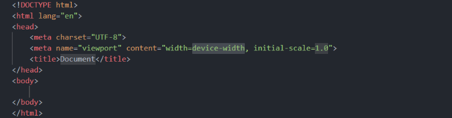

### 2. Install Live Server Extension

Install the Live Server extension in VSCode to preview your website in real-time:

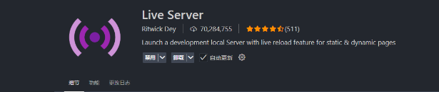

Click the "Go Live" button at the bottom of VSCode to start the server:

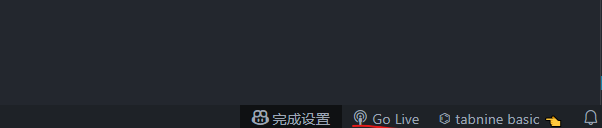

### 3. Set Up HTTP Server with npm

Install the http-server package to run your application:

```bash
npm install --save-dev http-server --legacy-peer-deps
```

Then stop Live Server and run:

```bash
npx http-server -c-1 --cors
```

This will display available URLs:

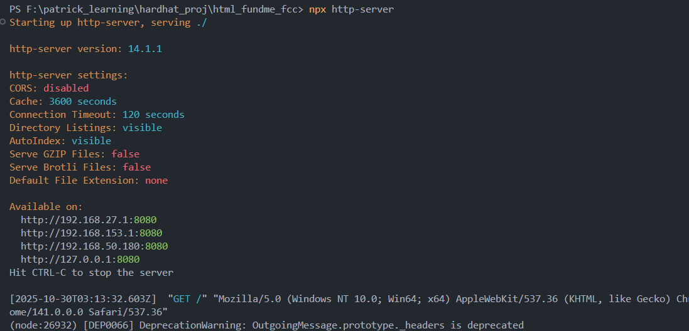

### 4. Add JavaScript Functionality

Create an `index.js` file with the connect function and button event listeners:

```javascript
async function connect() {
    if (typeof window.ethereum !== "undefined") {
        await window.ethereum.request({
            method: "eth_requestAccounts",
        });
        document.getElementById("connectButton").innerHTML = "Connected!";
    } else {
        document.getElementById("connectButton").innerHTML =
            "Please Install Metamask.";
    }
}

async function fund(ethAmount) {
    console.log(`Funding with ${ethAmount}...`);

    if (typeof window.ethereum !== "undefined") {
        /*
         * Sending transactions requires:
         * - Blockchain connection provider
         * - Signer (user with sufficient gas)
         * - Contract interaction (ABI and address)
         */
    }
}

const connectButton = document.getElementById("connectButton");
const fundButton = document.getElementById("fundButton");

connectButton.onclick = connect;
fundButton.onclick = fund;
```

### 5. Check MetaMask Installation

To verify MetaMask is installed, check for the `window.ethereum` object:

```javascript
if (typeof window.ethereum !== "undefined") {
    console.log("I see a Metamask!");
} else {
    console.log("No Metamask.");
}
```

**With MetaMask installed:**
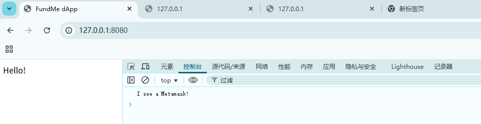

**Without MetaMask:**
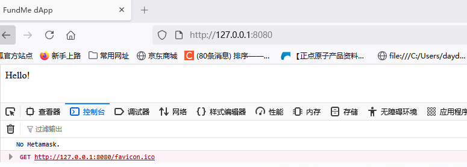

## Importing Ethers.js Library

### Using CDN Import (Recommended)

In `index.js`, import ethers from the CDN:

```javascript
import { ethers } from "https://cdnjs.cloudflare.com/ajax/libs/ethers.js/6.7.1/ethers.umd.min.js";
```

This approach avoids the need to manage node_modules and provides a direct browser-compatible version of ethers.

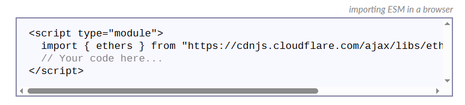

### Verifying Ethers Import

You can verify the ethers library is loaded by logging it to the console:

```javascript
console.log(ethers);
```

Refresh the page and check the console to see all available ethers APIs:

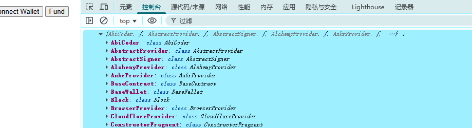

## Common Pitfalls & Solutions

### ⚠️ Pitfall 1: Red Flag Error (CSP Violation)

If you see a red flag error when trying to connect:


**Solution:** Try using a different IP address from the available options. For example, use `192.168.50.180:8080` instead of `127.0.0.1:8080`:

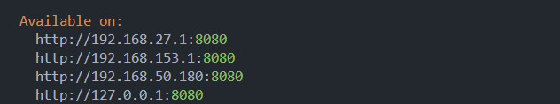

Once connected, the MetaMask popup will appear:

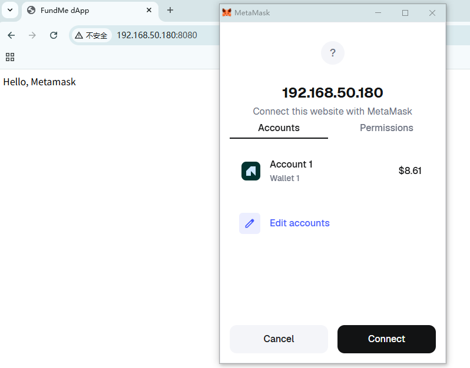

### ⚠️ Pitfall 2: Browser Cache Issues

If your code changes don't appear after refreshing, the browser may have cached the old version.

**Solution:** Hard refresh to clear the cache:

-   Right-click the refresh button
-   Select "Empty cache and hard refresh"

### ⚠️ Pitfall 3: MetaMask Not Popping Up

**Issue:** The connect function might trigger MetaMask popup on every page load, which can be annoying.

**Solution:** Wrap the connection logic in an async function and attach it to a button click only by using event listener assignment:

```javascript
const connectButton = document.getElementById("connectButton");
connectButton.onclick = connect;
```

This ensures the connection only triggers when the button is clicked, not on page load.

### ⚠️ Pitfall 4: HTTP Server Started in Wrong Directory

**Issue:** After restarting http-server, you experience various errors on the webpage.

**Solution:** Ensure you run the http-server command from the project's root directory:

```bash
npx http-server -c-1 --cors
```

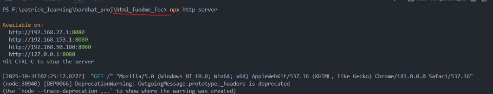

After confirming the correct directory, reload the webpage as needed:

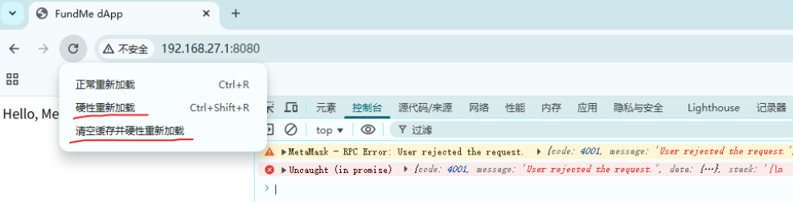

### ⚠️ Pitfall 5: Button Not Responding to Clicks

**Issue:** Buttons don't trigger functions after restructuring code.

**Solution:** When moving functions from inline onclick handlers to event listeners, ensure buttons have proper IDs and the event listeners are set up correctly:

```html
<button id="connectButton">Connect Wallet</button>
<button id="fundButton">Fund</button>
```

```javascript
const connectButton = document.getElementById("connectButton");
const fundButton = document.getElementById("fundButton");

connectButton.onclick = connect;
fundButton.onclick = fund;
```

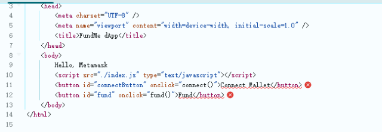

## Features Implemented

✅ MetaMask detection  
✅ Wallet connection functionality  
✅ Button-triggered connection (no auto-popup on page load)  
✅ Real-time button state update  
✅ Error handling  
✅ Ethers.js library integration  
✅ Fund function framework

## Running the Application

1. Ensure you're in the project root directory

2. Start the HTTP server:

    ```bash
    npx http-server -c-1 --cors
    ```

3. Open your browser and navigate to one of the provided URLs (e.g., `http://192.168.50.180:8080`)

4. Click the "Connect Wallet" button

5. Approve the connection in the MetaMask popup

6. Button text will update to "Connected!" upon successful connection

## Next Steps

-   Integrate ethers.js provider and signer for transaction handling
-   Implement fund() function with smart contract interactions
-   Add wallet balance display
-   Build complete transaction functionality
-   Consider upgrading to ReactJS/NextJS for more advanced UI

---

# Part 2: Sending Transactions on the Web

## BrowserProvider vs JsonRpcProvider

There are two main provider classes in ethers.js to connect with the blockchain. Here are their differences:

### BrowserProvider (ethers-v6)

Used to connect with **browser wallet plugins like MetaMask**

-   Retrieves connection through the `window.ethereum` object
-   Users can **sign transactions directly** (wallet will pop up for confirmation)
-   Ideal for frontend dApp development
-   **Only available in the browser environment**

```javascript
const provider = new ethers.BrowserProvider(window.ethereum);
const signer = await provider.getSigner();
```

**Key Point:** This is an asynchronous operation. You must use `await` to ensure you get a valid signer object.

### JsonRpcProvider

Used to connect with **public RPC nodes** (such as Alchemy, Infura, etc.)

-   Requires providing an RPC URL, for example: `https://eth-mainnet.g.alchemy.com/v2/your-key`
-   **Can only read data**, cannot sign transactions
-   Suitable for backend services or scenarios where you only need to query data

```javascript
const provider = new ethers.JsonRpcProvider(
    "https://eth-mainnet.g.alchemy.com/v2/key"
);
// Only able to read data
const balance = await provider.getBalance(address);
```

## Implementing the Fund Function - Sending Transactions

Now we need to implement the complete `fund()` function to send actual transactions. Here are the complete steps:

### Step 1: Import Required Constants

First, create a new file `constants.js` to store the contract's ABI and deployed address:

```javascript
// constants.js
export const abi = [
    // Copy the complete ABI from artifacts/contracts/FundMe.sol/FundMe.json
    // ... ABI content ...
];

export const contractAddress = "0xe7f1725E7734CE288F8367e1Bb143E90bb3F0512";
```

#### How to Get the ABI?

The ABI is stored in the compiled artifacts from Hardhat. Find it at: `hh_fundme_fcc/artifacts/contracts/FundMe.sol/FundMe.json`

Open that file, find the `"abi"` field, and copy its complete content into `constants.js`:

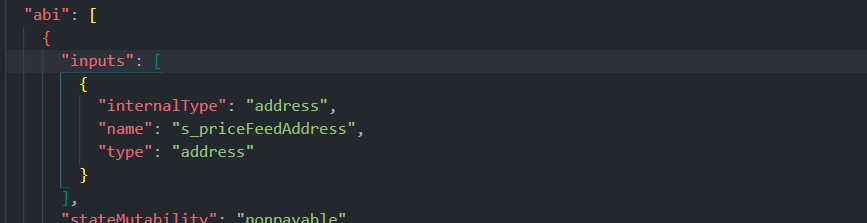

#### How to Get the Contract Address?

When you run a local Hardhat node, the contract is automatically deployed. Open another terminal window and run:

```bash
npx hardhat node
```

When the node starts, it will output the address of the deployed contract. Record this address and add it to `constants.js`:

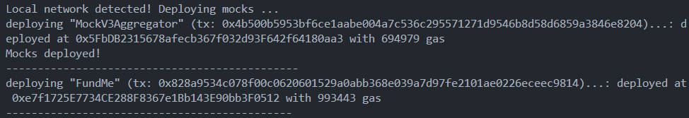

In `index.js`, import these constants:

```javascript
import * as ethers from "./ethers-6.7.esm.min.js";
import { abi, contractAddress } from "./constants.js";
```

### Step 2: Implement the Fund Function

Here is the complete `fund()` function implementation:

```javascript
async function fund(ethAmount) {
    ethAmount = "0.01";
    console.log(`Funding with ${ethAmount}...`);

    if (typeof window.ethereum !== "undefined") {
        /*
         * To send a transaction, you need three key components:
         * 1. provider: Connection to the blockchain
         * 2. signer: Wallet account with sufficient gas
         * 3. contract: Contract reference with ABI and address
         */

        // BrowserProvider connects to MetaMask's HTTP endpoint
        const provider = new ethers.BrowserProvider(window.ethereum);

        // Get the signer from MetaMask (must use await for async operation)
        const signer = await provider.getSigner();

        // Create a contract object to call contract functions
        const contract = new ethers.Contract(contractAddress, abi, signer);

        // Create and send the transaction
        try {
            const transactionResponse = await contract.fund({
                value: ethers.parseEther(ethAmount),
            });
            console.log(`Transaction sent: ${transactionResponse.hash}`);

            // Wait for transaction confirmation (1 block confirmation)
            await transactionResponse.wait(1);
            console.log("Transaction confirmed!");
        } catch (error) {
            console.error("Transaction failed:", error);
        }
    }
}
```

**Key Points:**

-   Use `await provider.getSigner()` to ensure you get a valid signer
-   `ethers.parseEther()` converts human-readable ETH amounts to wei
-   `contract.fund()` calls the fund function on the smart contract
-   Use try-catch to handle potential errors

### Step 3: Configure Hardhat Localhost Network in MetaMask

To allow MetaMask to connect to your local Hardhat node, you need to add a custom network:

1. Open MetaMask and click the menu icon (three horizontal lines) in the top right
2. Select **Networks** → **Add a custom network**
3. Fill in the following information:

| Field           | Value                 |
| --------------- | --------------------- |
| Network name    | Hardhat-Localhost     |
| Default RPC URL | http://127.0.0.1:8545 |
| Chain ID        | 31337                 |
| Currency symbol | ETH                   |

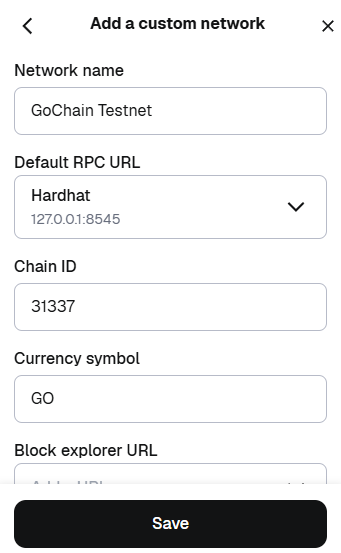

After saving the network, switch to the Hardhat-Localhost network:

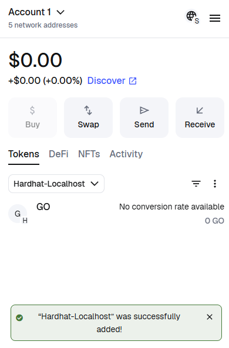

**Important Note:** The currency symbol should be set to `ETH` (the native coin), not `GO`. This is because the native currency of the Hardhat network is ETH, which is used to pay gas fees. The GO tokens in your account are ERC-20 standard tokens and cannot be used to pay gas fees.

### Step 4: Import Hardhat's Pre-funded Accounts

The local Hardhat node provides multiple pre-funded accounts, each with 10,000 ETH for testing. Import Account #0 to MetaMask:

**Account #0 Information:**

```
Address: 0xf39Fd6e51aad88F6F4ce6aB8827279cffFb92266
Private Key: 0xac0974bec39a17e36ba4a6b4d238ff944bacb478cbed5efcae784d7bf4f2ff80
Balance: 10,000 ETH
```

#### Importing Account via Private Key

In MetaMask:

1. Click the account avatar in the top right
2. Select **Import Account**
3. Choose **Private Key** as the import method
4. Paste the private key from above
5. Click **Import**

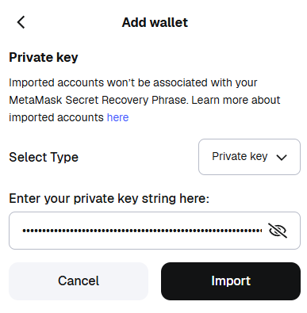

After successful import, you'll see the account has a large ETH balance (displayed as GO symbol, which is set in the network configuration):

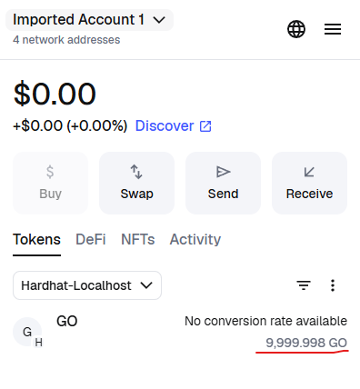

**Note:** You can also use JSON file import if preferred. The JSON file contains encrypted private key information.

### Step 5: Test Transaction Functionality

Now everything is ready to test the complete transaction flow:

1. Make sure your local Hardhat node is running:

    ```bash
    npx hardhat node
    ```

2. Start the HTTP server:

    ```bash
    npx http-server -c-1 --cors
    ```

3. Open your application in the browser and switch to the Hardhat-Localhost network

4. Click the **Connect Wallet** button to connect your wallet

5. Click the **Fund** button to send a transaction

6. MetaMask will pop up a transaction confirmation window showing the transaction details:

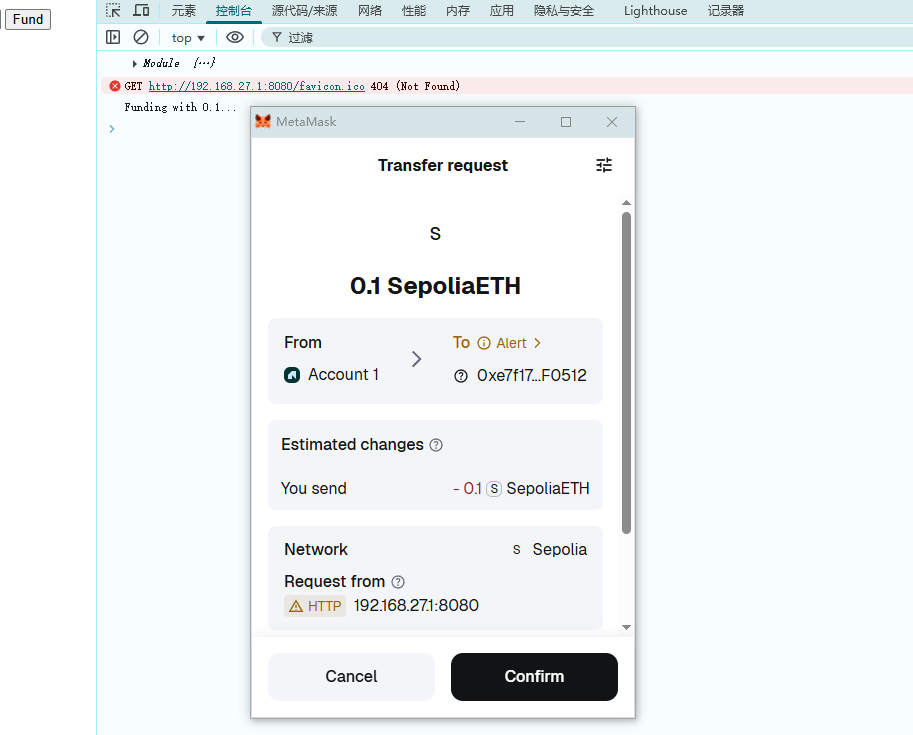

7. After confirming the transaction, you can see the transaction record in the Hardhat node terminal:

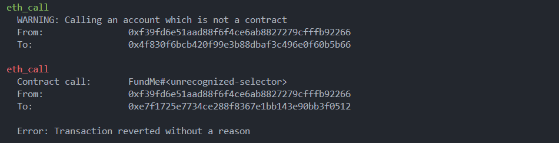

## Common Issues & Solutions

### ⚠️ Issue 1: Insufficient Funds Error

**Error Message:** `MetaMask - RPC Error: insufficient funds for gas * price * value`

**Cause:** Your account doesn't have enough ETH to pay gas fees.

**Solution:**

-   Import Hardhat's pre-funded account (see Step 4 above)
-   Or use a script to transfer ETH from the default account to your account

### ⚠️ Issue 2: Contract Runner Does Not Support Sending Transactions

**Error Message:** `contract runner does not support sending transactions`

**Cause:** The signer wasn't properly awaited, or the signer object is invalid.

**Solution:** Ensure you use `const signer = await provider.getSigner();` (note the await keyword)

### ⚠️ Issue 3: MetaMask Network Configuration Error

**Problem:** MetaMask cannot connect to the Hardhat node.

**Checklist:**

-   Is the RPC URL correct: `http://127.0.0.1:8545`?
-   Is the Chain ID set to 31337?
-   Is the Hardhat node running?
-   The network symbol can be any name, but ETH is recommended

## Project Accomplishments Summary

✅ Complete smart contract deployment setup  
✅ MetaMask network configuration  
✅ Frontend wallet connection functionality  
✅ Transaction signing and sending  
✅ Transaction confirmation waiting mechanism  
✅ Error handling and logging  
✅ Local testing environment

## Future Improvement Directions

-   Add real-time balance display
-   Implement withdraw() functionality
-   Build getBalance query interface
-   Add transaction history tracking
-   Upgrade to React framework for improved UI
-   Deploy to test networks (e.g., Sepolia)
-   Final deployment to mainnet
